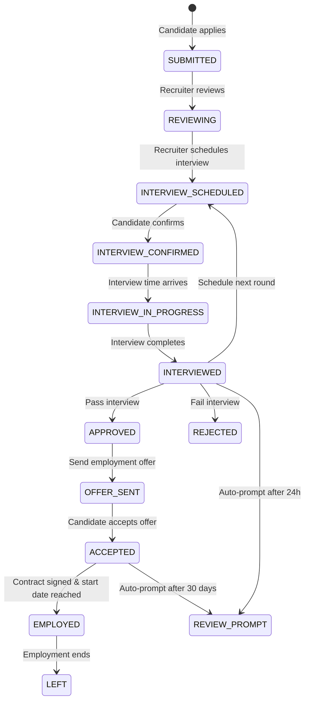

# Company Review Feature - Complete Implementation Guide

## 📋 Executive Summary

This document provides a comprehensive implementation plan for the **Company Review Feature** with staged review eligibility based on candidate journey tracking, **integrated with interview scheduling and tracking system**. The implementation follows **Option A** (extending the JobApply entity) as the most maintainable approach.

---

## 🎯 Feature Overview

### Purpose
Allow candidates to review companies based on their actual experience stage:
- **Application Experience** (7+ days, no response) - Review communication/responsiveness
- **Interview Experience** (completed interview) - Review interview process
- **Work Experience** (30+ days employed) - Review culture, management, benefits

### Integrated Interview Management
- **Interview Scheduling** - Recruiters schedule interviews with date/time/location
- **Automatic Tracking** - System tracks interview status and prompts next actions
- **Smart Transitions** - Enable status changes only after interview time passes
- **Review Prompts** - Automatic candidate review eligibility after interview completion
- **Contract Management** - Track hiring offers and employment contracts

### Key Benefits
- ✅ Verified reviews linked to actual job applications
- ✅ Stage-based review types prevent fake/irrelevant reviews
- ✅ Automatic eligibility tracking based on JobApply lifecycle
- ✅ AI-powered duplicate detection and sentiment analysis via Weaviate
- ✅ Complete audit trail for all status changes
- ✅ **Automated interview scheduling and tracking workflow**
- ✅ **Time-based validation for status transitions**
- ✅ **Proactive candidate review prompts after interview**
- ✅ **Bilateral status verification** (both parties can update/dispute status)
- ✅ **Candidate-initiated status updates** (prevents recruiter negligence)
- ✅ **Flexible interview rescheduling** (with mutual consent)
- ✅ **Dispute resolution system** (handles status conflicts)

---

## 🔐 Bilateral Status Verification & Dispute Resolution

### The Problem

**Scenario 1: Recruiter Doesn't Update Status**
- Candidate gets fired but recruiter doesn't mark contract as TERMINATED
- System thinks candidate still employed → incorrect review eligibility
- Candidate appears "still working" after leaving

**Scenario 2: Conflicting Status Claims**
- Recruiter marks as "FIRED_PERFORMANCE"
- Candidate claims "RESIGNED"
- Who is telling the truth?

**Scenario 3: Interview Schedule Changes**
- Recruiter schedules 2-hour interview
- Interview only takes 30 minutes
- Time validation blocks status change prematurely
- Or recruiter extends interview, system blocks completion

### The Solution: Multi-Party Verification System

---

## 🎯 Candidate-Initiated Status Updates

### Feature: "Report Employment Status Change"

Allows candidates to proactively update their employment status when recruiters fail to do so.

#### API Endpoint

```http
POST /api/job-applies/{jobApplyId}/candidate-status-update
Authorization: Bearer {candidate_token}
Content-Type: application/json

Request Body:
{
  "newStatus": "TERMINATED",
  "claimedTerminationType": "RESIGNATION",
  "claimedTerminationDate": "2026-03-15",
  "reason": "I resigned on March 15, 2026, but my status was never updated",
  "evidence": [
    {
      "type": "RESIGNATION_LETTER",
      "fileUrl": "https://storage.example.com/resignation-letter.pdf"
    },
    {
      "type": "EMAIL_SCREENSHOT",
      "fileUrl": "https://storage.example.com/resignation-email.png"
    }
  ]
}

Response: 202 Accepted
{
  "updateId": 789,
  "status": "PENDING_VERIFICATION",
  "message": "Status update submitted. Recruiter will be notified to confirm.",
  "verificationDeadline": "2026-03-22T23:59:59",
  "nextSteps": "If recruiter doesn't respond within 7 days, status will auto-update."
}
```

#### Workflow

**Step 1: Candidate Submits Update**
```java
public StatusUpdateRequest submitCandidateStatusUpdate(
    Long jobApplyId, 
    CandidateStatusUpdateRequest request
) {
    JobApply jobApply = jobApplyRepo.findById(jobApplyId)
        .orElseThrow(() -> new ResourceNotFoundException("JobApply not found"));
    
    // Verify candidate owns this application
    if (!jobApply.getCandidate().getId().equals(getCurrentCandidateId())) {
        throw new UnauthorizedException("Not your application");
    }
    
    // Create pending status update request
    StatusUpdateRequest updateRequest = new StatusUpdateRequest();
    updateRequest.setJobApply(jobApply);
    updateRequest.setRequestedBy(UserType.CANDIDATE);
    updateRequest.setCurrentStatus(jobApply.getStatus());
    updateRequest.setRequestedStatus(request.getNewStatus());
    updateRequest.setClaimedTerminationType(request.getClaimedTerminationType());
    updateRequest.setClaimedTerminationDate(request.getClaimedTerminationDate());
    updateRequest.setReason(request.getReason());
    updateRequest.setStatus(RequestStatus.PENDING_VERIFICATION);
    updateRequest.setVerificationDeadline(LocalDateTime.now().plusDays(7));
    updateRequest.setEvidenceFiles(request.getEvidence());
    
    statusUpdateRequestRepo.save(updateRequest);
    
    // Notify recruiter immediately
    notificationService.sendStatusUpdateVerificationRequest(
        jobApply.getRecruiter(),
        updateRequest
    );
    
    // Schedule auto-approval job if no response in 7 days
    scheduleAutoApproval(updateRequest.getId(), 7);
    
    return updateRequest;
}
```

**Step 2: Recruiter Verification (3 Options)**

**Option A: Confirm (Agree)**
```http
POST /api/status-updates/{updateId}/confirm
Authorization: Bearer {recruiter_token}

Request Body:
{
  "confirmed": true,
  "actualTerminationType": "RESIGNATION",  // Can correct if needed
  "actualTerminationDate": "2026-03-15",
  "notes": "Confirmed. Candidate resigned as stated."
}

Response: 200 OK
{
  "status": "CONFIRMED",
  "jobApplyStatus": "TERMINATED",
  "employmentVerificationUpdated": true
}
```

**Option B: Dispute (Disagree)**
```http
POST /api/status-updates/{updateId}/dispute
Authorization: Bearer {recruiter_token}

Request Body:
{
  "disputed": true,
  "recruiterClaimedStatus": "ACCEPTED",  // Still employed
  "recruiterClaimedTerminationType": "FIRED_PERFORMANCE",  // Or different type
  "counterEvidence": [
    {
      "type": "TERMINATION_LETTER",
      "fileUrl": "https://storage.example.com/termination.pdf"
    }
  ],
  "reason": "Employee was terminated for performance issues, not resignation"
}

Response: 202 Accepted
{
  "status": "DISPUTED",
  "message": "Dispute filed. Case escalated to admin review.",
  "disputeId": 456
}
```

**Option C: No Response (7 days)**
```java
@Scheduled(cron = "0 0 3 * * ?")  // Daily at 3 AM
public void autoApproveExpiredRequests() {
    List<StatusUpdateRequest> expiredRequests = statusUpdateRequestRepo
        .findByStatusAndVerificationDeadlineBefore(
            RequestStatus.PENDING_VERIFICATION, 
            LocalDateTime.now()
        );
    
    for (StatusUpdateRequest request : expiredRequests) {
        // Auto-approve if recruiter didn't respond
        request.setStatus(RequestStatus.AUTO_APPROVED);
        request.setApprovedAt(LocalDateTime.now());
        request.setApprovedBy("SYSTEM");
        request.setApprovalReason("Recruiter did not respond within 7 days");
        
        // Update job apply status
        JobApply jobApply = request.getJobApply();
        jobApply.setStatus(request.getRequestedStatus());
        jobApply.setLeftAt(request.getClaimedTerminationDate());
        
        // Update contract if exists
        EmploymentContract contract = jobApply.getEmploymentContract();
        if (contract != null) {
            contract.setStatus(ContractStatus.TERMINATED);
            contract.setTerminationType(request.getClaimedTerminationType());
            contract.setTerminationDate(request.getClaimedTerminationDate().toLocalDate());
            contract.setTerminationReason("Auto-updated: " + request.getReason());
        }
        
        // Notify both parties
        notificationService.sendAutoApprovalNotification(request);
    }
}
```

---

## ⚖️ Dispute Resolution System

### When Candidate and Recruiter Disagree

**Scenario: Conflicting Termination Claims**
- Candidate: "I resigned on March 15"
- Recruiter: "We fired you for performance on March 10"

```java
public class StatusDispute {
    private Long id;
    private StatusUpdateRequest originalRequest;
    private DisputeStatus status;  // OPEN, UNDER_REVIEW, RESOLVED
    
    // Candidate's claim
    private StatusJobApply candidateClaimedStatus;
    private TerminationType candidateClaimedType;
    private LocalDateTime candidateClaimedDate;
    private List<EvidenceFile> candidateEvidence;
    
    // Recruiter's counter-claim
    private StatusJobApply recruiterClaimedStatus;
    private TerminationType recruiterClaimedType;
    private LocalDateTime recruiterClaimedDate;
    private List<EvidenceFile> recruiterEvidence;
    
    // Resolution
    private Long resolvedByAdminId;
    private LocalDateTime resolvedAt;
    private StatusJobApply finalStatus;
    private TerminationType finalTerminationType;
    private String resolutionReason;
}
```

### Admin Dispute Resolution Workflow

**Step 1: Admin Reviews Evidence**
```http
GET /api/admin/disputes/{disputeId}
Authorization: Bearer {admin_token}

Response: 200 OK
{
  "disputeId": 456,
  "jobApplyId": 123,
  "candidateName": "John Doe",
  "companyName": "Tech Corp",
  
  "candidateClaim": {
    "status": "TERMINATED",
    "terminationType": "RESIGNATION",
    "date": "2026-03-15",
    "evidence": [
      {
        "type": "RESIGNATION_LETTER",
        "url": "...",
        "uploadedAt": "2026-03-15T09:00:00"
      }
    ],
    "reason": "I resigned professionally with 2 weeks notice"
  },
  
  "recruiterClaim": {
    "status": "TERMINATED",
    "terminationType": "FIRED_PERFORMANCE",
    "date": "2026-03-10",
    "evidence": [
      {
        "type": "TERMINATION_LETTER",
        "url": "...",
        "uploadedAt": "2026-03-10T14:00:00"
      },
      {
        "type": "PERFORMANCE_REVIEW",
        "url": "...",
        "uploadedAt": "2026-03-05T10:00:00"
      }
    ],
    "reason": "Terminated for consistent failure to meet performance standards"
  },
  
  "timeline": [
    "2026-03-05: Performance review documented",
    "2026-03-10: Recruiter uploaded termination letter",
    "2026-03-15: Candidate uploaded resignation letter",
    "2026-03-20: Candidate submitted status update request"
  ]
}
```

**Step 2: Admin Makes Decision**
```http
POST /api/admin/disputes/{disputeId}/resolve
Authorization: Bearer {admin_token}

Request Body:
{
  "finalStatus": "TERMINATED",
  "finalTerminationType": "FIRED_PERFORMANCE",
  "finalTerminationDate": "2026-03-10",
  "rulingReason": "Evidence shows termination letter dated March 10, before resignation letter dated March 15. Recruiter's claim is supported by documented performance review from March 5.",
  "noteToCandidate": "Your resignation came after the termination notice. The official record shows termination on March 10.",
  "noteToRecruiter": "Status has been updated to reflect the termination."
}

Response: 200 OK
{
  "disputeId": 456,
  "status": "RESOLVED",
  "finalDecision": {
    "status": "TERMINATED",
    "terminationType": "FIRED_PERFORMANCE",
    "date": "2026-03-10"
  }
}
```

---

## 🕐 Flexible Interview Scheduling

### Problem: Rigid Time Validation

Current system blocks status changes based on scheduled time, but real interviews vary:
- Interview scheduled for 2 hours, ends in 30 minutes
- Interview scheduled for 1 hour, extends to 2 hours
- Technical issues delay start time

### Solution: Flexible Duration + Manual Override

#### 1. Interview Time Adjustment (During Interview)

```http
PATCH /api/interviews/{interviewId}/adjust-duration
Authorization: Bearer {recruiter_token}

Request Body:
{
  "newDurationMinutes": 90,  // Extended from 60 to 90
  "reason": "Additional technical questions"
}

Response: 200 OK
{
  "scheduledDate": "2025-12-01T14:00:00",
  "originalDuration": 60,
  "newDuration": 90,
  "newEndTime": "2025-12-01T15:30:00"
}
```

#### 2. Early Completion (Interview Shorter Than Expected)

```http
POST /api/interviews/{interviewId}/complete-early
Authorization: Bearer {recruiter_token}

Request Body:
{
  "actualEndTime": "2025-12-01T14:30:00",  // Scheduled until 15:00
  "reason": "Interview concluded early - all questions answered",
  "outcome": "PASS"
}

Response: 200 OK
{
  "status": "COMPLETED",
  "actualDuration": 30,
  "scheduledDuration": 60,
  "completedEarly": true
}
```

#### 3. Reschedule with Candidate Consent

```http
POST /api/interviews/{interviewId}/reschedule-request
Authorization: Bearer {recruiter_token}

Request Body:
{
  "newScheduledDate": "2025-12-02T14:00:00",
  "reason": "Interviewer unavailable due to emergency",
  "requiresCandidateConsent": true
}

Response: 202 Accepted
{
  "rescheduleRequestId": 999,
  "status": "PENDING_CANDIDATE_CONSENT",
  "message": "Candidate will be notified. Reschedule will apply once confirmed.",
  "expiresAt": "2025-11-27T23:59:59"
}
```

**Candidate Response:**
```http
POST /api/interviews/reschedule-requests/{requestId}/respond
Authorization: Bearer {candidate_token}

Request Body:
{
  "accepted": true,
  "message": "No problem, see you on Dec 2nd"
}

Response: 200 OK
{
  "interviewId": 789,
  "newScheduledDate": "2025-12-02T14:00:00",
  "status": "RESCHEDULED",
  "consensusReached": true
}
```

---

## 🔔 Proactive Status Verification Reminders

### Automatic Recruiter Reminders

**30 Days After Hire:**
```java
@Scheduled(cron = "0 0 10 * * ?")  // Daily at 10 AM
public void sendEmploymentVerificationReminders() {
    LocalDateTime thirtyDaysAgo = LocalDateTime.now().minusDays(30);
    
    List<JobApply> hiredCandidates = jobApplyRepo
        .findByStatusAndHiredAtBetween(
            StatusJobApply.ACCEPTED, 
            thirtyDaysAgo.minusDays(1), 
            thirtyDaysAgo.plusDays(1)
        );
    
    for (JobApply jobApply : hiredCandidates) {
        emailService.sendEmail(
            jobApply.getRecruiter().getEmail(),
            "Employment Status Verification Needed",
            "Please confirm if " + jobApply.getCandidate().getName() + 
            " is still employed. They were hired 30 days ago on " + 
            jobApply.getHiredAt().toLocalDate() + ".\n\n" +
            "Actions:\n" +
            "- Still employed: No action needed\n" +
            "- Left/Terminated: Update status via dashboard\n\n" +
            "[Update Status Button]"
        );
    }
}
```

**Every 90 Days After Hire:**
```java
@Scheduled(cron = "0 0 10 1 * ?")  // 1st of every month at 10 AM
public void sendQuarterlyEmploymentVerification() {
    List<JobApply> longTermEmployed = jobApplyRepo
        .findByStatusAndHiredAtBefore(
            StatusJobApply.ACCEPTED,
            LocalDateTime.now().minusDays(90)
        );
    
    for (JobApply jobApply : longTermEmployed) {
        long daysEmployed = Duration.between(
            jobApply.getHiredAt(), 
            LocalDateTime.now()
        ).toDays();
        
        emailService.sendEmail(
            jobApply.getRecruiter().getEmail(),
            "Quarterly Employment Verification",
            jobApply.getCandidate().getName() + " has been employed for " + 
            daysEmployed + " days. Please verify their current status.\n\n" +
            "Is this employee still active?\n" +
            "[Yes, Still Employed] [No, Update Status]"
        );
    }
}
```

---

## 🎫 Candidate Self-Service Dashboard

### "My Employment Status" Section

Candidate can see and challenge their status:

```
┌─────────────────────────────────────────────────────┐
│ Your Employment Status at Tech Corp                │
├─────────────────────────────────────────────────────┤
│ Status: ACCEPTED (Employed)                         │
│ Hired: January 1, 2026                              │
│ Days Employed: 74 days                              │
│                                                      │
│ ⚠️ Status Incorrect?                                │
│ [Report Status Change]                              │
│                                                      │
│ Last Verified: March 10, 2026 (by recruiter)       │
└─────────────────────────────────────────────────────┘
```

**If Candidate Clicks "Report Status Change":**
- Form appears with dropdown: "I resigned / I was fired / I was laid off / Other"
- Date picker: "When did this happen?"
- Upload evidence: "Upload resignation letter, termination notice, or final payslip"
- Text explanation: "Describe what happened"
- Submit → Creates StatusUpdateRequest

---

## 🏗️ Architecture Changes

### Option A: Extend JobApply Entity (IMPLEMENTED)

#### Core Components

1. **StatusJobApply Enum** - Enhanced with 7 new statuses
   ```java
   SUBMITTED           // Initial application
   REVIEWING           // Under review
   INTERVIEW_SCHEDULED // NEW - Interview arranged
   INTERVIEWED         // NEW - Interview completed
   APPROVED            // Approved for next stage
   ACCEPTED            // NEW - Hired/employed
   REJECTED            // Not selected
   BANNED              // Blacklisted
   NO_RESPONSE         // NEW - Company ghosted (7+ days)
   WITHDRAWN           // NEW - Candidate withdrew
   TERMINATED          // NEW - Employment ended (fired/resigned)
   PROBATION_FAILED    // NEW - Terminated during probation period
   ```

2. **JobApply Entity** - 7 new date tracking fields
   ```java
   private LocalDateTime interviewScheduledAt;  // When interview scheduled
   private LocalDateTime interviewedAt;         // When interview occurred
   private LocalDateTime hiredAt;               // When hired
   private LocalDateTime leftAt;                // When employment ended
   private LocalDateTime lastContactAt;         // Last company communication
   private LocalDateTime statusChangedAt;       // Last status update
   ```

3. **JobApplyStatusHistory** - Audit trail table
   - Tracks all status transitions
   - Records who made changes and why
   - Enables eligibility calculations

4. **CompanyReview Entity** - Main review table
   - Links to JobApply, Candidate, Recruiter, JobPosting
   - Supports 3 review types with different rating aspects
   - Includes Weaviate integration fields

---

## 📁 File Structure Created

```
src/main/java/com/fpt/careermate/
├── common/constant/
│   └── StatusJobApply.java (UPDATED - 5 new statuses)
│
├── services/job_services/
│   ├── domain/
│   │   ├── JobApply.java (UPDATED - 7 new fields + helper methods)
│   │   └── JobApplyStatusHistory.java (NEW - audit trail)
│   ├── repository/
│   │   └── JobApplyStatusHistoryRepo.java (NEW)
│   └── service/
│       └── JobApplyImp.java (UPDATED - transition validation, history tracking)
│
└── services/review_services/
    ├── constant/
    │   ├── ReviewType.java (NEW - APPLICATION/INTERVIEW/WORK_EXPERIENCE)
    │   ├── CandidateQualification.java (NEW - eligibility levels)
    │   └── ReviewStatus.java (NEW - ACTIVE/FLAGGED/REMOVED/ARCHIVED)
    ├── domain/
    │   └── CompanyReview.java (NEW - main review entity)
    ├── repository/
    │   └── CompanyReviewRepo.java (NEW - with semantic queries)
    └── service/
        ├── ReviewEligibilityService.java (NEW - eligibility checker)
        └── impl/
            └── CompanyReviewService.java (NEW - interface)

database/
└── migration_company_review_feature.sql (NEW - full migration script)
```

---

## 🗄️ Database Changes

### Migration Script: `migration_company_review_feature.sql`

#### Step 1: Alter job_apply table
```sql
ALTER TABLE job_apply
ADD COLUMN interview_scheduled_at TIMESTAMP NULL,
ADD COLUMN interviewed_at TIMESTAMP NULL,
ADD COLUMN hired_at TIMESTAMP NULL,
ADD COLUMN left_at TIMESTAMP NULL,
ADD COLUMN last_contact_at TIMESTAMP NULL,
ADD COLUMN status_changed_at TIMESTAMP DEFAULT CURRENT_TIMESTAMP;
```

#### Step 2: Create job_apply_status_history table
```sql
CREATE TABLE job_apply_status_history (
    id SERIAL PRIMARY KEY,
    job_apply_id INT NOT NULL,
    previous_status VARCHAR(50),
    new_status VARCHAR(50) NOT NULL,
    changed_at TIMESTAMP DEFAULT CURRENT_TIMESTAMP,
    changed_by_user_id INT,
    change_reason VARCHAR(500),
    FOREIGN KEY (job_apply_id) REFERENCES job_apply(id)
);
```

#### Step 3: Create interview_schedule table (NEW - Interview Management)
```sql
CREATE TABLE interview_schedule (
    id SERIAL PRIMARY KEY,
    job_apply_id INT NOT NULL UNIQUE,
    interview_round INT NOT NULL DEFAULT 1,
    
    -- Interview details
    scheduled_date TIMESTAMP NOT NULL,
    duration_minutes INT DEFAULT 60,
    interview_type VARCHAR(50) NOT NULL,  -- IN_PERSON, VIDEO_CALL, PHONE, ONLINE_ASSESSMENT
    location VARCHAR(500),  -- Physical address or video call link
    
    -- Instructions
    interviewer_name VARCHAR(255),
    interviewer_email VARCHAR(255),
    interviewer_phone VARCHAR(50),
    preparation_notes TEXT,  -- What to bring, dress code, topics to prepare
    meeting_link VARCHAR(500),  -- Zoom/Teams/Google Meet link
    
    -- Status tracking
    status VARCHAR(50) NOT NULL DEFAULT 'SCHEDULED',  -- SCHEDULED, CONFIRMED, COMPLETED, CANCELLED, NO_SHOW
    candidate_confirmed BOOLEAN DEFAULT FALSE,
    candidate_confirmed_at TIMESTAMP,
    
    -- Reminders
    reminder_sent_24h BOOLEAN DEFAULT FALSE,
    reminder_sent_2h BOOLEAN DEFAULT FALSE,
    
    -- Results (filled after interview)
    interview_completed_at TIMESTAMP,
    interviewer_notes TEXT,
    outcome VARCHAR(50),  -- PASS, FAIL, PENDING, NEEDS_SECOND_ROUND
    
    -- Metadata
    created_at TIMESTAMP DEFAULT CURRENT_TIMESTAMP,
    updated_at TIMESTAMP,
    created_by_recruiter_id INT NOT NULL,
    
    FOREIGN KEY (job_apply_id) REFERENCES job_apply(id) ON DELETE CASCADE,
    FOREIGN KEY (created_by_recruiter_id) REFERENCES recruiter(id)
);

CREATE INDEX idx_interview_schedule_date ON interview_schedule(scheduled_date);
CREATE INDEX idx_interview_schedule_status ON interview_schedule(status);
CREATE INDEX idx_interview_upcoming ON interview_schedule(scheduled_date, status) 
    WHERE status IN ('SCHEDULED', 'CONFIRMED');
```

#### Step 4: Create employment_verification table (NEW - Privacy-Focused Employment Tracking)
```sql
-- Simplified employment tracking (review eligibility only - NO sensitive data)
CREATE TABLE employment_verification (
    id SERIAL PRIMARY KEY,
    job_apply_id INT NOT NULL UNIQUE,
    
    -- Core employment info (minimal data for review validation)
    employment_type VARCHAR(50) NOT NULL,  -- FULL_TIME, PART_TIME, CONTRACT, INTERNSHIP
    start_date DATE NOT NULL,
    end_date DATE,  -- NULL = currently employed
    
    -- Status tracking
    is_probation BOOLEAN DEFAULT TRUE,
    probation_end_date DATE,
    is_active BOOLEAN DEFAULT TRUE,
    
    -- Termination info (for review context only)
    termination_type VARCHAR(50),  
    -- RESIGNATION, FIRED_PERFORMANCE, FIRED_MISCONDUCT, LAID_OFF, MUTUAL_AGREEMENT, PROBATION_FAILED, END_OF_CONTRACT
    termination_date DATE,
    days_employed INT,  -- Auto-calculated: (end_date or CURRENT_DATE) - start_date
    
    -- Verification tracking (bilateral verification support)
    last_verified_at TIMESTAMP,
    verified_by_recruiter_id INT,
    
    -- Metadata
    created_at TIMESTAMP DEFAULT CURRENT_TIMESTAMP,
    updated_at TIMESTAMP,
    created_by_recruiter_id INT NOT NULL,
    
    FOREIGN KEY (job_apply_id) REFERENCES job_apply(id) ON DELETE CASCADE,
    FOREIGN KEY (created_by_recruiter_id) REFERENCES recruiter(id),
    FOREIGN KEY (verified_by_recruiter_id) REFERENCES recruiter(id)
);

CREATE INDEX idx_employment_verification_active ON employment_verification(is_active, start_date);
CREATE INDEX idx_employment_verification_end_date ON employment_verification(end_date) WHERE end_date IS NOT NULL;

-- Function to auto-calculate days_employed
CREATE OR REPLACE FUNCTION calculate_days_employed()
RETURNS TRIGGER AS $$
BEGIN
    NEW.days_employed := COALESCE(NEW.end_date, CURRENT_DATE) - NEW.start_date;
    RETURN NEW;
END;
$$ LANGUAGE plpgsql;

CREATE TRIGGER trigger_calculate_days_employed
BEFORE INSERT OR UPDATE ON employment_verification
FOR EACH ROW
EXECUTE FUNCTION calculate_days_employed();
```

#### Step 5: Create status_update_request table (NEW - Bilateral Verification)
```sql
CREATE TABLE status_update_request (
    id SERIAL PRIMARY KEY,
    job_apply_id INT NOT NULL,
    
    -- Request details
    requested_by VARCHAR(20) NOT NULL,  -- CANDIDATE, RECRUITER, ADMIN
    current_status VARCHAR(50) NOT NULL,
    requested_status VARCHAR(50) NOT NULL,
    
    -- Termination details (if applicable)
    claimed_termination_type VARCHAR(50),
    claimed_termination_date TIMESTAMP,
    reason TEXT NOT NULL,
    
    -- Verification workflow
    status VARCHAR(50) NOT NULL DEFAULT 'PENDING_VERIFICATION',  -- PENDING_VERIFICATION, CONFIRMED, DISPUTED, AUTO_APPROVED, REJECTED
    verification_deadline TIMESTAMP,
    
    -- Response tracking
    confirmed_by_user_type VARCHAR(20),  -- CANDIDATE, RECRUITER
    confirmed_at TIMESTAMP,
    confirmed_by_user_id INT,
    confirmation_notes TEXT,
    
    -- Metadata
    created_at TIMESTAMP DEFAULT CURRENT_TIMESTAMP,
    updated_at TIMESTAMP,
    
    FOREIGN KEY (job_apply_id) REFERENCES job_apply(id) ON DELETE CASCADE
);

CREATE INDEX idx_status_update_pending ON status_update_request(status, verification_deadline) 
    WHERE status = 'PENDING_VERIFICATION';
CREATE INDEX idx_status_update_job_apply ON status_update_request(job_apply_id);
```

#### Step 6: Create evidence_file table (NEW - Supporting Documents)
```sql
CREATE TABLE evidence_file (
    id SERIAL PRIMARY KEY,
    status_update_request_id INT,
    dispute_id INT,
    
    -- File details
    file_type VARCHAR(50) NOT NULL,  -- RESIGNATION_LETTER, TERMINATION_LETTER, EMAIL_SCREENSHOT, PAYSLIP, PERFORMANCE_REVIEW
    file_url VARCHAR(500) NOT NULL,
    file_name VARCHAR(255) NOT NULL,
    file_size_bytes BIGINT,
    mime_type VARCHAR(100),
    
    -- Uploader
    uploaded_by_user_type VARCHAR(20) NOT NULL,  -- CANDIDATE, RECRUITER, ADMIN
    uploaded_by_user_id INT NOT NULL,
    uploaded_at TIMESTAMP DEFAULT CURRENT_TIMESTAMP,
    
    -- Verification
    verified_by_admin_id INT,
    verified_at TIMESTAMP,
    is_authentic BOOLEAN,
    
    FOREIGN KEY (status_update_request_id) REFERENCES status_update_request(id) ON DELETE CASCADE
);

CREATE INDEX idx_evidence_file_request ON evidence_file(status_update_request_id);
```

#### Step 7: Create status_dispute table (NEW - Conflict Resolution)
```sql
CREATE TABLE status_dispute (
    id SERIAL PRIMARY KEY,
    status_update_request_id INT NOT NULL,
    job_apply_id INT NOT NULL,
    
    -- Dispute status
    status VARCHAR(50) NOT NULL DEFAULT 'OPEN',  -- OPEN, UNDER_REVIEW, RESOLVED, CLOSED
    
    -- Candidate's claim
    candidate_claimed_status VARCHAR(50),
    candidate_claimed_termination_type VARCHAR(50),
    candidate_claimed_termination_date TIMESTAMP,
    candidate_reason TEXT,
    
    -- Recruiter's counter-claim
    recruiter_claimed_status VARCHAR(50),
    recruiter_claimed_termination_type VARCHAR(50),
    recruiter_claimed_termination_date TIMESTAMP,
    recruiter_reason TEXT,
    
    -- Resolution
    resolved_by_admin_id INT,
    resolved_at TIMESTAMP,
    final_status VARCHAR(50),
    final_termination_type VARCHAR(50),
    final_termination_date TIMESTAMP,
    resolution_reason TEXT,
    note_to_candidate TEXT,
    note_to_recruiter TEXT,
    
    -- Metadata
    created_at TIMESTAMP DEFAULT CURRENT_TIMESTAMP,
    updated_at TIMESTAMP,
    
    FOREIGN KEY (status_update_request_id) REFERENCES status_update_request(id) ON DELETE CASCADE,
    FOREIGN KEY (job_apply_id) REFERENCES job_apply(id) ON DELETE CASCADE,
    FOREIGN KEY (resolved_by_admin_id) REFERENCES admin(id)
);

CREATE INDEX idx_dispute_status ON status_dispute(status);
CREATE INDEX idx_dispute_job_apply ON status_dispute(job_apply_id);
```

#### Step 8: Create interview_reschedule_request table (NEW - Flexible Scheduling)
```sql
CREATE TABLE interview_reschedule_request (
    id SERIAL PRIMARY KEY,
    interview_schedule_id INT NOT NULL,
    
    -- Reschedule details
    original_date TIMESTAMP NOT NULL,
    new_requested_date TIMESTAMP NOT NULL,
    reason TEXT NOT NULL,
    
    -- Consent tracking
    requested_by VARCHAR(20) NOT NULL,  -- RECRUITER, CANDIDATE
    requires_consent BOOLEAN DEFAULT TRUE,
    consent_given BOOLEAN,
    consent_given_at TIMESTAMP,
    consent_given_by_user_id INT,
    
    -- Status
    status VARCHAR(50) NOT NULL DEFAULT 'PENDING_CONSENT',  -- PENDING_CONSENT, ACCEPTED, REJECTED, EXPIRED
    expires_at TIMESTAMP,
    
    -- Metadata
    created_at TIMESTAMP DEFAULT CURRENT_TIMESTAMP,
    updated_at TIMESTAMP,
    
    FOREIGN KEY (interview_schedule_id) REFERENCES interview_schedule(id) ON DELETE CASCADE
);

CREATE INDEX idx_reschedule_pending ON interview_reschedule_request(status, expires_at) 
    WHERE status = 'PENDING_CONSENT';
```

#### Step 5: Create company_review table
```sql
CREATE TABLE company_review (
    id SERIAL PRIMARY KEY,
    candidate_id INT NOT NULL,
    recruiter_id INT NOT NULL,
    job_apply_id INT NOT NULL,
    job_posting_id INT NOT NULL,
    review_type VARCHAR(50) NOT NULL,  -- APPLICATION/INTERVIEW/WORK_EXPERIENCE
    status VARCHAR(50) NOT NULL DEFAULT 'ACTIVE',
    review_text TEXT NOT NULL,
    overall_rating INT NOT NULL CHECK (overall_rating BETWEEN 1 AND 5),
    -- Aspect-specific ratings (nullable)
    communication_rating INT,
    responsiveness_rating INT,
    interview_process_rating INT,
    work_culture_rating INT,
    management_rating INT,
    benefits_rating INT,
    work_life_balance_rating INT,
    -- Timestamps
    created_at TIMESTAMP DEFAULT CURRENT_TIMESTAMP,
    updated_at TIMESTAMP,
    -- Privacy & verification
    is_anonymous BOOLEAN DEFAULT FALSE,
    is_verified BOOLEAN DEFAULT TRUE,
    -- Moderation
    flag_count INT DEFAULT 0,
    removal_reason VARCHAR(500),
    -- Weaviate integration
    weaviate_id VARCHAR(255) UNIQUE,
    sentiment_score DECIMAL(3, 2),
    duplicate_check_hash VARCHAR(255),
    -- Constraints
    UNIQUE (job_apply_id, review_type)  -- One review per type per application
);
```

#### Step 4: Create helpful views
- `company_review_stats` - Aggregated ratings per company
- `candidate_review_eligibility` - Shows eligible review types per candidate

---

## 🔄 Status Transition Logic

### Valid Transitions (Enforced by `isValidStatusTransition()`)

```
SUBMITTED
  ├── REVIEWING
  ├── INTERVIEW_SCHEDULED
  ├── APPROVED
  ├── REJECTED
  ├── NO_RESPONSE
  └── WITHDRAWN

REVIEWING
  ├── INTERVIEW_SCHEDULED
  ├── APPROVED
  ├── REJECTED
  └── WITHDRAWN

INTERVIEW_SCHEDULED
  ├── INTERVIEWED
  ├── APPROVED
  ├── REJECTED
  └── WITHDRAWN

INTERVIEWED
  ├── INTERVIEW_SCHEDULED (next round)
  ├── APPROVED
  └── REJECTED

APPROVED
  ├── ACCEPTED (hired)
  ├── REJECTED (changed mind)
  └── WITHDRAWN

ACCEPTED
  └── BANNED (only terminal transition)

REJECTED / BANNED / NO_RESPONSE / WITHDRAWN
  └── (Terminal states - no transitions allowed)
```

### Automatic Timestamp Updates

When status changes, relevant timestamps are automatically set:

| New Status | Auto-Set Timestamp |
|------------|-------------------|
| `INTERVIEW_SCHEDULED` | `interviewScheduledAt`, `lastContactAt` |
| `INTERVIEWED` | `interviewedAt`, `lastContactAt` |
| `ACCEPTED` | `hiredAt`, `lastContactAt` |
| `REVIEWING`, `APPROVED`, `REJECTED` | `lastContactAt` |
| `NO_RESPONSE` | (No update - that's the point) |

---

## 📅 Interview Scheduling & Tracking Workflow

### Overview
The interview scheduling system provides end-to-end management of the interview process, from scheduling to completion, with automatic status tracking and review prompts.

### Workflow States



### Interview Scheduling Process

#### Phase 1: Schedule Interview (Recruiter Action)

**Trigger:** Recruiter changes status to `INTERVIEW_SCHEDULED`

**Required Information:**
```json
{
  "jobApplyId": 123,
  "newStatus": "INTERVIEW_SCHEDULED",
  "interviewDetails": {
    "scheduledDate": "2025-12-01T14:00:00",
    "durationMinutes": 60,
    "interviewType": "VIDEO_CALL",
    "interviewerName": "John Doe",
    "interviewerEmail": "john.doe@company.com",
    "meetingLink": "https://zoom.us/j/123456789",
    "preparationNotes": "Please prepare a portfolio presentation (10 mins). Dress code: Business casual.",
    "interviewRound": 1
  }
}
```

**System Actions:**
1. ✅ Create `InterviewSchedule` record
2. ✅ Update `JobApply.interviewScheduledAt` = current timestamp
3. ✅ Update `JobApply.lastContactAt` = current timestamp
4. ✅ Record status change in `JobApplyStatusHistory`
5. ✅ Send email notification to candidate with interview details
6. ✅ Add to candidate's calendar (iCal invite)
7. ✅ Schedule automated reminders (24h, 2h before)

**Validation Rules:**
- ❌ Cannot schedule interview if `scheduledDate` is in the past
- ❌ Cannot schedule interview if status is not `REVIEWING` or `SUBMITTED`
- ✅ Can reschedule by updating existing `InterviewSchedule`
- ✅ Can schedule multiple rounds (increment `interviewRound`)

#### Phase 2: Candidate Confirmation (Optional)

**Trigger:** Candidate clicks "Confirm Attendance" in email

**System Actions:**
1. ✅ Update `InterviewSchedule.candidateConfirmed` = true
2. ✅ Update `InterviewSchedule.candidateConfirmedAt` = current timestamp
3. ✅ Send confirmation email to recruiter
4. ✅ Update `InterviewSchedule.status` = `CONFIRMED`

#### Phase 3: Automated Reminders

**Scheduled Jobs:**

**24 Hours Before Interview:**
```java
@Scheduled(cron = "0 0 * * * *")  // Every hour
public void send24HourReminders() {
    LocalDateTime targetTime = LocalDateTime.now().plusHours(24);
    
    List<InterviewSchedule> interviews = interviewRepo.findUpcomingInterviews(
        targetTime.minusMinutes(30), 
        targetTime.plusMinutes(30)
    );
    
    for (InterviewSchedule interview : interviews) {
        if (!interview.getReminderSent24h()) {
            sendReminderEmail(interview, "24_HOUR_REMINDER");
            interview.setReminderSent24h(true);
        }
    }
}
```

**2 Hours Before Interview:**
- Similar logic with `reminderSent2h` flag
- Include meeting link prominently
- Last chance to reschedule message

#### Phase 4: Interview Time Management

**System Checks (Real-time):**

```java
public boolean canTransitionToInterviewed(JobApply jobApply) {
    InterviewSchedule schedule = interviewRepo.findByJobApplyId(jobApply.getId());
    
    if (schedule == null) {
        return false;  // Must have scheduled interview
    }
    
    LocalDateTime now = LocalDateTime.now();
    LocalDateTime interviewEndTime = schedule.getScheduledDate()
        .plusMinutes(schedule.getDurationMinutes());
    
    // Can only mark as INTERVIEWED after interview time has passed
    return now.isAfter(interviewEndTime);
}
```

**Recruiter Dashboard Indicators:**
- 🔴 **Before Interview Time**: Button disabled, shows countdown "Interview in 2 hours"
- 🟡 **During Interview**: Button shows "Interview in progress"
- 🟢 **After Interview Time**: Button enabled "Mark as Completed"

#### Phase 5: Mark Interview Completed (Recruiter Action)

**Trigger:** Recruiter changes status to `INTERVIEWED`

**Required Information:**
```json
{
  "jobApplyId": 123,
  "newStatus": "INTERVIEWED",
  "interviewOutcome": {
    "interviewerNotes": "Strong technical skills, good cultural fit",
    "outcome": "PASS",  // PASS, FAIL, PENDING, NEEDS_SECOND_ROUND
    "nextSteps": "Schedule technical assessment"
  }
}
```

**System Actions:**
1. ✅ Update `JobApply.interviewedAt` = actual completion time
2. ✅ Update `JobApply.status` = `INTERVIEWED`
3. ✅ Update `InterviewSchedule.status` = `COMPLETED`
4. ✅ Update `InterviewSchedule.interviewCompletedAt` = current timestamp
5. ✅ Update `InterviewSchedule.interviewerNotes` = provided notes
6. ✅ Update `InterviewSchedule.outcome` = result
7. ✅ Record status change in history
8. ✅ **Schedule review prompt** for 24 hours later
9. ✅ Send notification to candidate about interview completion

**Time-Based Validation:**
```java
// In JobApplyImp.updateJobApply()
if (newStatus == StatusJobApply.INTERVIEWED) {
    InterviewSchedule schedule = interviewRepo.findByJobApplyId(jobApply.getId());
    
    if (schedule == null) {
        throw new AppException(ErrorCode.INTERVIEW_NOT_SCHEDULED);
    }
    
    LocalDateTime interviewEndTime = schedule.getScheduledDate()
        .plusMinutes(schedule.getDurationMinutes());
    
    if (LocalDateTime.now().isBefore(interviewEndTime)) {
        throw new AppException(ErrorCode.INTERVIEW_NOT_YET_COMPLETED,
            "Interview is scheduled until " + interviewEndTime);
    }
}
```

#### Phase 6: Next Round or Final Decision

**If Second Round Needed:**
```
INTERVIEWED → INTERVIEW_SCHEDULED (interviewRound = 2)
```
- Repeat scheduling process
- Link to previous interview notes
- Track which round candidate is on

**If Pass Interview:**
```
INTERVIEWED → APPROVED → Send Offer
```

**If Fail Interview:**
```
INTERVIEWED → REJECTED
```
- Auto-prompt candidate for interview review after 24 hours
- Thank candidate for their time

### Hiring & Employment Verification

#### Phase 7: Candidate Accepts Offer & Employment Starts

**Trigger:** Recruiter changes status to `ACCEPTED` (hired)

**Required Information:**
```json
{
  "jobApplyId": 123,
  "newStatus": "ACCEPTED",
  "employmentDetails": {
    "employmentType": "FULL_TIME",
    "startDate": "2026-01-01",
    "isProbation": true,
    "probationEndDate": "2026-04-01"  // Optional: 3 months probation
  }
}
```

**System Actions:**
1. ✅ Update `JobApply.status` = `ACCEPTED`
2. ✅ Update `JobApply.hiredAt` = current timestamp
3. ✅ Create `EmploymentVerification` record (minimal tracking)
4. ✅ Send congratulations email to candidate
5. ✅ Notify recruiter of hire confirmation
6. ✅ Close job posting if position filled

**Important: No Sensitive Data Stored**
- ❌ NO salary information
- ❌ NO contract documents
- ❌ NO benefits details
- ✅ ONLY employment duration for review eligibility

#### Phase 8: Employment Duration Tracking

**Auto-Calculate Days Employed:**
```java
@Scheduled(cron = "0 0 1 * * *")  // Daily at 1 AM
public void updateEmploymentDurations() {
    List<EmploymentVerification> activeEmployments = 
        employmentVerificationRepo.findByIsActiveTrue();
    
    for (EmploymentVerification employment : activeEmployments) {
        // Days employed auto-calculated by database trigger
        // (end_date or CURRENT_DATE) - start_date
        
        // Check probation status
        if (employment.getIsProbation() && 
            LocalDate.now().isAfter(employment.getProbationEndDate())) {
            employment.setIsProbation(false);
            log.info("Probation period completed for JobApply: {}", 
                employment.getJobApplyId());
        }
    }
    
    employmentVerificationRepo.saveAll(activeEmployments);
}
```

#### Phase 9: Review Eligibility Triggers

**After 30 Days Employment:**
```java
@Scheduled(cron = "0 0 2 * * *")  // Daily at 2 AM
public void promptWorkExperienceReviews() {
    LocalDateTime thirtyDaysAgo = LocalDateTime.now().minusDays(30);
    
    List<JobApply> eligibleForReview = jobApplyRepo.findByStatusAndHiredAtBefore(
        StatusJobApply.ACCEPTED,
        thirtyDaysAgo
    );
    
    for (JobApply jobApply : eligibleForReview) {
        // Check if candidate already reviewed
        boolean hasReview = reviewRepo.existsByJobApplyIdAndReviewType(
            jobApply.getId(),
            ReviewType.WORK_EXPERIENCE
        );
        
        if (!hasReview) {
            sendReviewPromptNotification(jobApply, ReviewType.WORK_EXPERIENCE);
        }
    }
}
```

### Recruiter Dashboard - Interview Tracking

**Features Needed:**

1. **Upcoming Interviews Calendar View**
   - Show all scheduled interviews
   - Color-coded by status (confirmed/pending)
   - Quick actions: Reschedule, Cancel, Add Notes

2. **Interview Pipeline View**
   ```
   Application → Screening → Interview 1 → Interview 2 → Offer → Hired
   
   Each stage shows:
   - Number of candidates
   - Average time in stage
   - Conversion rate to next stage
   ```

3. **Action Required Notifications**
   - ⏰ Interview completed, mark outcome (shows after interview time passes)
   - 📧 Candidate hasn't confirmed (24h before interview)
   - ❌ Offer expiring in 2 days
   - ✅ Contract ready for signing

4. **Status Change Validation**
   - Shows why button is disabled
   - Displays countdown/time remaining
   - Shows required information still needed

### Time-Based Business Rules

| Action | Time Constraint | Validation |
|--------|----------------|------------|
| **Schedule Interview** | Must be future date/time | `scheduledDate > now` |
| **Mark as INTERVIEWED** | After interview end time | `now > interviewEndTime` |
| **Mark as NO_SHOW** | After interview start time | `now > scheduledDate && !completed` |
| **Reschedule Interview** | At least 2 hours before | `scheduledDate - now > 2 hours` |
| **Send Offer** | After interview completion | `status == INTERVIEWED` |
| **Review Eligibility** | After interview + 24h | `interviewedAt + 24h < now` |
| **Work Review Eligibility** | After hired + 30 days | `hiredAt + 30 days < now` |
| **Candidate Status Update** | Can report anytime | No restrictions (always allowed) |
| **Recruiter Must Verify** | Within 7 days | `requestDate + 7 days` |
| **Auto-Approval** | If no recruiter response | After 7 days silence |
| **Interview Reschedule** | Requires mutual consent | Both parties must agree |
| **Interview Duration Adjust** | Anytime during interview | Real-time adjustment |
| **Early Interview Completion** | After 50% of scheduled time | `actualTime > scheduledTime * 0.5` |
| **Status Verification Reminder** | Every 30/90 days | Automated email to recruiter |

---

## 📊 Business Rules Matrix

### Status Update Authority

| Current Status | Recruiter Can Change To | Candidate Can Request | Auto-Approved If No Response |
|---------------|------------------------|---------------------|----------------------------|
| SUBMITTED | Any status | WITHDRAWN | N/A |
| REVIEWING | Any status | WITHDRAWN | N/A |
| INTERVIEW_SCHEDULED | INTERVIEWED, NO_SHOW, WITHDRAWN | WITHDRAWN | N/A |
| INTERVIEWED | APPROVED, REJECTED | N/A | N/A |
| ACCEPTED | TERMINATED | TERMINATED, PROBATION_FAILED | ✅ Yes (7 days) |
| TERMINATED | N/A | Can dispute termination type | N/A |

### Termination Type Authority

| Who Can Claim | RESIGNATION | FIRED_PERFORMANCE | FIRED_MISCONDUCT | LAID_OFF | MUTUAL_AGREEMENT |
|--------------|------------|------------------|-----------------|---------|-----------------|
| Candidate | ✅ Yes | ❌ No* | ❌ No* | ✅ Yes | ✅ Yes |
| Recruiter | ✅ Yes | ✅ Yes | ✅ Yes | ✅ Yes | ✅ Yes |

*Candidate can claim RESIGNATION, but if recruiter disputes with FIRED_*, goes to admin review.

### Evidence Weight

| Evidence Type | Trust Score | Description |
|--------------|-------------|-------------|
| Official termination letter (signed) | 10/10 | Highest authority |
| Resignation letter (signed) | 10/10 | Highest authority |
| Email from HR/Manager | 8/10 | Strong evidence |
| Final payslip | 7/10 | Shows last payment date |
| Performance review documents | 6/10 | Supports firing claim |
| Screenshot of email | 5/10 | Can be doctored |
| Personal statement | 3/10 | Weakest evidence |

### Admin Resolution Guidelines

**If evidence conflicts:**
1. **Document date precedence**: Earlier document wins
   - Termination letter dated March 10 > Resignation dated March 15
2. **Official documents > screenshots**: Signed letters > emails
3. **Multiple documents**: Party with more evidence wins
4. **No clear winner**: Default to candidate's claim (benefit of doubt)

### Interview Flexibility Rules

| Scenario | Business Rule | Example |
|---------|--------------|---------|
| **Interview runs shorter** | Can complete after 50% time passes | 60min interview ends at 30min → Allowed |
| **Interview runs longer** | Recruiter can extend in real-time | 60min → Extend to 90min during interview |
| **Reschedule < 2h notice** | Requires candidate consent | Emergency reschedule needs approval |
| **Reschedule > 2h notice** | Recruiter can reschedule unilaterally | Standard reschedule |
| **Candidate requests reschedule** | Always requires recruiter consent | Candidate must ask permission |
| **Multiple reschedules** | Max 3 reschedules per interview round | After 3, must reject or proceed |

---

## 🎫 Review Eligibility Rules

### ReviewEligibilityService Logic

```java
// CandidateQualification levels
HIRED              // Employed 30+ days → Can review all 3 types
INTERVIEWED        // Completed interview → Can review application + interview
REJECTED           // Rejected → Can review up to stage reached
APPLICANT          // Applied 7+ days, no response → Can review application only
NOT_ELIGIBLE       // Too early or no qualifying actions
```

### Eligibility Calculation

```java
public CandidateQualification determineQualification(JobApply jobApply) {
    // Priority order (most qualified first)
    
    if (status == ACCEPTED && daysEmployed >= 30) 
        return HIRED;
    
    if (interviewedAt != null) 
        return INTERVIEWED;
    
    if (status IN [REJECTED, BANNED]) 
        return REJECTED;
    
    if (daysSinceApplication >= 7 && status IN [SUBMITTED, NO_RESPONSE]) 
        return APPLICANT;
    
    return NOT_ELIGIBLE;
}
```

### Review Type Permissions

| Qualification | APPLICATION_EXPERIENCE | INTERVIEW_EXPERIENCE | WORK_EXPERIENCE |
|--------------|----------------------|---------------------|----------------|
| **HIRED** | ✅ Yes | ✅ Yes | ✅ Yes |
| **INTERVIEWED** | ✅ Yes | ✅ Yes | ❌ No |
| **REJECTED** | ✅ Yes | ✅ Yes (if interviewed) | ❌ No |
| **APPLICANT** | ✅ Yes | ❌ No | ❌ No |
| **NOT_ELIGIBLE** | ❌ No | ❌ No | ❌ No |

---

## 🔌 API Endpoints

### Interview Scheduling Endpoints (NEW)

#### 1. Schedule Interview

```http
POST /api/job-applies/{jobApplyId}/schedule-interview
Authorization: Bearer {recruiter_token}
Content-Type: application/json

Request Body:
{
  "scheduledDate": "2025-12-01T14:00:00",
  "durationMinutes": 60,
  "interviewType": "VIDEO_CALL",
  "interviewerName": "John Doe",
  "interviewerEmail": "john.doe@company.com",
  "interviewerPhone": "+84-123-456-789",
  "meetingLink": "https://zoom.us/j/123456789",
  "location": "Office Room 301 or Video Call",
  "preparationNotes": "Please prepare portfolio presentation",
  "interviewRound": 1
}

Response: 201 Created
{
  "id": 789,
  "jobApplyId": 123,
  "scheduledDate": "2025-12-01T14:00:00",
  "status": "SCHEDULED",
  "interviewType": "VIDEO_CALL",
  "meetingLink": "https://zoom.us/j/123456789",
  "calendarInvite": "https://api.example.com/calendar/invite/789.ics"
}
```

#### 2. Candidate Confirm Interview

```http
POST /api/interviews/{interviewId}/confirm
Authorization: Bearer {candidate_token}

Response: 200 OK
{
  "status": "CONFIRMED",
  "candidateConfirmedAt": "2025-11-26T10:00:00"
}
```

#### 3. Reschedule Interview

```http
PUT /api/interviews/{interviewId}/reschedule
Authorization: Bearer {recruiter_token}
Content-Type: application/json

Request Body:
{
  "scheduledDate": "2025-12-02T15:00:00",
  "reason": "Interviewer unavailable"
}

Response: 200 OK
{
  "id": 789,
  "scheduledDate": "2025-12-02T15:00:00",
  "status": "RESCHEDULED"
}

Validation Error (if too late):
{
  "error": "RESCHEDULE_TOO_LATE",
  "message": "Cannot reschedule less than 2 hours before interview"
}
```

#### 4. Mark Interview Completed

```http
POST /api/interviews/{interviewId}/complete
Authorization: Bearer {recruiter_token}
Content-Type: application/json

Request Body:
{
  "interviewerNotes": "Strong technical skills, good communication",
  "outcome": "PASS",
  "nextSteps": "Schedule technical assessment"
}

Response: 200 OK
{
  "id": 789,
  "status": "COMPLETED",
  "interviewCompletedAt": "2025-12-01T15:05:00",
  "jobApplyStatus": "INTERVIEWED"
}

Validation Error (if too early):
{
  "error": "INTERVIEW_NOT_YET_COMPLETED",
  "message": "Interview is scheduled until 2025-12-01 15:00. Please wait until after this time.",
  "timeRemaining": "55 minutes"
}
```

#### 5. Get Recruiter's Interview Schedule

```http
GET /api/interviews/recruiter/schedule?startDate=2025-12-01&endDate=2025-12-31&status=SCHEDULED
Authorization: Bearer {recruiter_token}

Response: 200 OK
{
  "interviews": [
    {
      "id": 789,
      "candidateName": "Jane Smith",
      "jobTitle": "Software Engineer",
      "scheduledDate": "2025-12-01T14:00:00",
      "status": "CONFIRMED",
      "interviewType": "VIDEO_CALL",
      "timeUntilInterview": "5 days 3 hours",
      "canMarkCompleted": false,
      "actions": {
        "reschedule": true,
        "cancel": true,
        "markCompleted": false
      }
    }
  ]
}
```

#### 6. Get Candidate's Interview Schedule

```http
GET /api/interviews/candidate/upcoming
Authorization: Bearer {candidate_token}

Response: 200 OK
{
  "upcomingInterviews": [
    {
      "id": 789,
      "companyName": "Tech Corp",
      "jobTitle": "Software Engineer",
      "scheduledDate": "2025-12-01T14:00:00",
      "durationMinutes": 60,
      "interviewType": "VIDEO_CALL",
      "meetingLink": "https://zoom.us/j/123456789",
      "interviewerName": "John Doe",
      "interviewerEmail": "john.doe@techcorp.com",
      "preparationNotes": "Prepare portfolio presentation",
      "status": "CONFIRMED",
      "timeUntilInterview": "5 days 3 hours",
      "canConfirm": false,
      "addToCalendarLink": "https://api.example.com/calendar/789.ics"
    }
  ]
}
```

#### 7. Mark Candidate No-Show

```http
POST /api/interviews/{interviewId}/no-show
Authorization: Bearer {recruiter_token}

Response: 200 OK
{
  "status": "NO_SHOW",
  "jobApplyStatus": "REJECTED"
}
```

#### 8. Adjust Interview Duration (During Interview) (NEW)

```http
PATCH /api/interviews/{interviewId}/adjust-duration
Authorization: Bearer {recruiter_token}
Content-Type: application/json

Request Body:
{
  "newDurationMinutes": 90,
  "reason": "Additional technical assessment needed"
}

Response: 200 OK
{
  "interviewId": 789,
  "originalDuration": 60,
  "newDuration": 90,
  "newEndTime": "2025-12-01T15:30:00",
  "canMarkCompletedAt": "2025-12-01T15:30:00"
}
```

#### 9. Complete Interview Early (NEW)

```http
POST /api/interviews/{interviewId}/complete-early
Authorization: Bearer {recruiter_token}
Content-Type: application/json

Request Body:
{
  "actualEndTime": "2025-12-01T14:30:00",
  "reason": "All questions answered, candidate performed excellently",
  "outcome": "PASS"
}

Response: 200 OK
{
  "interviewId": 789,
  "status": "COMPLETED",
  "scheduledDuration": 60,
  "actualDuration": 30,
  "completedEarly": true,
  "jobApplyStatus": "INTERVIEWED"
}

Validation: Must be at least 50% of scheduled duration
Error Response (if too early):
{
  "error": "INTERVIEW_TOO_SHORT",
  "message": "Interview must last at least 30 minutes (50% of 60 min scheduled)",
  "minimumTime": "2025-12-01T14:30:00"
}
```

#### 10. Request Interview Reschedule (NEW)

```http
POST /api/interviews/{interviewId}/reschedule-request
Authorization: Bearer {recruiter_token} or {candidate_token}
Content-Type: application/json

Request Body:
{
  "newScheduledDate": "2025-12-02T14:00:00",
  "reason": "Emergency meeting conflict",
  "requiresConsent": true
}

Response: 202 Accepted
{
  "rescheduleRequestId": 999,
  "status": "PENDING_CONSENT",
  "message": "Other party will be notified to approve reschedule",
  "expiresAt": "2025-11-27T23:59:59"
}
```

#### 11. Respond to Reschedule Request (NEW)

```http
POST /api/interviews/reschedule-requests/{requestId}/respond
Authorization: Bearer {candidate_token} or {recruiter_token}
Content-Type: application/json

Request Body:
{
  "accepted": true,
  "message": "No problem, the new time works for me"
}

Response: 200 OK
{
  "rescheduleRequestId": 999,
  "status": "ACCEPTED",
  "interviewUpdated": true,
  "newScheduledDate": "2025-12-02T14:00:00"
}
```

---

### Candidate Status Update Endpoints (NEW - Bilateral Verification)

#### 1. Candidate Reports Status Change

```http
POST /api/job-applies/{jobApplyId}/candidate-status-update
Authorization: Bearer {candidate_token}
Content-Type: application/json

Request Body:
{
  "newStatus": "TERMINATED",
  "claimedTerminationType": "RESIGNATION",
  "claimedTerminationDate": "2026-03-15",
  "reason": "I resigned with 2 weeks notice but status was never updated",
  "evidence": [
    {
      "type": "RESIGNATION_LETTER",
      "fileUrl": "https://storage.example.com/resignation.pdf",
      "fileName": "resignation-letter-signed.pdf"
    },
    {
      "type": "EMAIL_SCREENSHOT",
      "fileUrl": "https://storage.example.com/email-proof.png",
      "fileName": "resignation-email.png"
    }
  ]
}

Response: 202 Accepted
{
  "updateRequestId": 789,
  "status": "PENDING_VERIFICATION",
  "message": "Status update submitted. Recruiter has 7 days to verify.",
  "verificationDeadline": "2026-03-22T23:59:59",
  "autoApproveDate": "2026-03-22",
  "nextSteps": "If recruiter doesn't respond, status will automatically update on March 22."
}
```

#### 2. Recruiter Confirms Status Update

```http
POST /api/status-updates/{updateId}/confirm
Authorization: Bearer {recruiter_token}
Content-Type: application/json

Request Body:
{
  "confirmed": true,
  "actualTerminationType": "RESIGNATION",
  "actualTerminationDate": "2026-03-15",
  "notes": "Confirmed. Employee resigned professionally with proper notice."
}

Response: 200 OK
{
  "updateRequestId": 789,
  "status": "CONFIRMED",
  "jobApplyUpdated": true,
  "employmentVerificationUpdated": true,
  "finalStatus": "TERMINATED",
  "finalTerminationType": "RESIGNATION",
  "daysEmployed": 74
}
```

#### 3. Recruiter Disputes Status Update

```http
POST /api/status-updates/{updateId}/dispute
Authorization: Bearer {recruiter_token}
Content-Type: application/json

Request Body:
{
  "disputed": true,
  "recruiterClaimedStatus": "TERMINATED",
  "recruiterClaimedTerminationType": "FIRED_PERFORMANCE",
  "recruiterClaimedTerminationDate": "2026-03-10",
  "reason": "Employee was terminated for performance issues 5 days before alleged resignation",
  "counterEvidence": [
    {
      "type": "TERMINATION_LETTER",
      "fileUrl": "https://storage.example.com/termination.pdf",
      "fileName": "termination-notice.pdf"
    },
    {
      "type": "PERFORMANCE_REVIEW",
      "fileUrl": "https://storage.example.com/perf-review.pdf",
      "fileName": "q1-performance-review.pdf"
    }
  ]
}

Response: 202 Accepted
{
  "updateRequestId": 789,
  "status": "DISPUTED",
  "disputeId": 456,
  "message": "Dispute filed. Case escalated to admin review.",
  "timeline": "Admin will review within 5 business days"
}
```

#### 4. Get Status Update Request Status

```http
GET /api/status-updates/{updateId}
Authorization: Bearer {candidate_token} or {recruiter_token}

Response: 200 OK
{
  "updateRequestId": 789,
  "jobApplyId": 123,
  "status": "PENDING_VERIFICATION",
  "requestedBy": "CANDIDATE",
  "requestedStatus": "TERMINATED",
  "claimedTerminationType": "RESIGNATION",
  "claimedTerminationDate": "2026-03-15",
  "verificationDeadline": "2026-03-22T23:59:59",
  "daysRemaining": 5,
  "evidence": [
    {
      "type": "RESIGNATION_LETTER",
      "fileName": "resignation-letter-signed.pdf",
      "uploadedAt": "2026-03-15T09:00:00"
    }
  ]
}
```

---

### Admin Dispute Resolution Endpoints (NEW)

#### 1. Get All Open Disputes

```http
GET /api/admin/disputes?status=OPEN&page=0&size=10
Authorization: Bearer {admin_token}

Response: 200 OK
{
  "disputes": [
    {
      "disputeId": 456,
      "jobApplyId": 123,
      "candidateName": "John Doe",
      "companyName": "Tech Corp",
      "status": "OPEN",
      "createdAt": "2026-03-16T10:00:00",
      "urgencyLevel": "HIGH",
      "daysOpen": 2
    }
  ],
  "totalElements": 15,
  "openDisputesCount": 15
}
```

#### 2. Get Dispute Details

```http
GET /api/admin/disputes/{disputeId}
Authorization: Bearer {admin_token}

Response: 200 OK
{
  "disputeId": 456,
  "jobApplyId": 123,
  "candidate": {
    "id": 789,
    "name": "John Doe",
    "email": "john@example.com"
  },
  "recruiter": {
    "id": 456,
    "name": "Jane Smith",
    "company": "Tech Corp"
  },
  
  "candidateClaim": {
    "status": "TERMINATED",
    "terminationType": "RESIGNATION",
    "date": "2026-03-15T00:00:00",
    "reason": "I resigned professionally with 2 weeks notice",
    "evidence": [
      {
        "id": 111,
        "type": "RESIGNATION_LETTER",
        "fileName": "resignation-letter-signed.pdf",
        "url": "https://storage.example.com/resignation.pdf",
        "uploadedAt": "2026-03-15T09:00:00",
        "verified": false
      }
    ]
  },
  
  "recruiterClaim": {
    "status": "TERMINATED",
    "terminationType": "FIRED_PERFORMANCE",
    "date": "2026-03-10T00:00:00",
    "reason": "Terminated for consistent performance failures",
    "evidence": [
      {
        "id": 222,
        "type": "TERMINATION_LETTER",
        "fileName": "termination-notice.pdf",
        "url": "https://storage.example.com/termination.pdf",
        "uploadedAt": "2026-03-10T14:00:00",
        "verified": false
      },
      {
        "id": 223,
        "type": "PERFORMANCE_REVIEW",
        "fileName": "q1-performance-review.pdf",
        "url": "https://storage.example.com/perf-review.pdf",
        "uploadedAt": "2026-03-05T10:00:00",
        "verified": false
      }
    ]
  },
  
  "timeline": [
    "2026-03-05: Performance review documented",
    "2026-03-10: Termination letter issued (recruiter claim)",
    "2026-03-15: Resignation letter submitted (candidate claim)",
    "2026-03-16: Candidate requested status update",
    "2026-03-16: Recruiter disputed, case escalated"
  ],
  
  "recommendation": "Evidence shows termination letter dated 5 days before resignation. Recruiter's claim appears stronger."
}
```

#### 3. Resolve Dispute

```http
POST /api/admin/disputes/{disputeId}/resolve
Authorization: Bearer {admin_token}
Content-Type: application/json

Request Body:
{
  "finalStatus": "TERMINATED",
  "finalTerminationType": "FIRED_PERFORMANCE",
  "finalTerminationDate": "2026-03-10",
  "rulingReason": "Evidence review shows termination letter was issued on March 10, predating the resignation letter by 5 days. Performance review documentation from March 5 supports the termination claim. While the candidate may have intended to resign, the official termination occurred first.",
  "noteToCandidate": "After reviewing all evidence, the termination date of March 10 is confirmed. Your resignation letter came after the official termination notice. The status has been updated accordingly.",
  "noteToRecruiter": "Dispute resolved in your favor. Status updated to reflect termination on March 10, 2026."
}

Response: 200 OK
{
  "disputeId": 456,
  "status": "RESOLVED",
  "resolvedAt": "2026-03-18T15:30:00",
  "resolvedBy": "Admin Sarah Johnson",
  "finalDecision": {
    "status": "TERMINATED",
    "terminationType": "FIRED_PERFORMANCE",
    "date": "2026-03-10"
  },
  "jobApplyUpdated": true,
  "contractUpdated": true,
  "notificationsSent": {
    "candidate": true,
    "recruiter": true
  }
}
```

---

### Employment Contract Endpoints (ENHANCED)

#### 1. Send Employment Offer

```http
POST /api/job-applies/{jobApplyId}/send-offer
Authorization: Bearer {recruiter_token}
Content-Type: application/json

Request Body:
{
  "positionTitle": "Senior Software Engineer",
  "employmentType": "FULL_TIME",
  "salaryAmount": 50000000,
  "salaryCurrency": "VND",
  "startDate": "2026-01-01",
  "benefits": "Health insurance, 15 days PTO, annual bonus",
  "offerExpiryDate": "2025-12-15"
}

Response: 201 Created
{
  "contractId": 456,
  "status": "DRAFT",
  "offerLetterUrl": "https://api.example.com/contracts/456/offer-letter.pdf"
}
```

#### 2. Candidate Accept/Reject Offer

```http
POST /api/contracts/{contractId}/respond
Authorization: Bearer {candidate_token}
Content-Type: application/json

Request Body:
{
  "response": "ACCEPT",  // or "REJECT"
  "message": "Thank you for the opportunity!"
}

Response: 200 OK
{
  "contractId": 456,
  "status": "SENT",
  "jobApplyStatus": "ACCEPTED",
  "nextSteps": "Please sign the contract via the link sent to your email"
}
```

#### 3. Sign Contract

```http
POST /api/contracts/{contractId}/sign
Authorization: Bearer {candidate_token} or {recruiter_token}
Content-Type: application/json

Request Body:
{
  "signatureData": "base64_encoded_signature",
  "ipAddress": "192.168.1.1"
}

Response: 200 OK
{
  "contractId": 456,
  "status": "SIGNED",
  "candidateSignedAt": "2025-12-10T10:00:00",
  "recruiterSignedAt": "2025-12-10T14:00:00",
  "isFullySigned": true
}
```

#### 4. Get Contract Status

```http
GET /api/contracts/{contractId}/status
Authorization: Bearer {candidate_token} or {recruiter_token}

Response: 200 OK
{
  "contractId": 456,
  "status": "SIGNED",
  "candidateSignedAt": "2025-12-10T10:00:00",
  "recruiterSignedAt": "2025-12-10T14:00:00",
  "startDate": "2026-01-01",
  "daysUntilStart": 37
}
```

#### 5. Terminate Contract

```http
POST /api/contracts/{contractId}/terminate
Authorization: Bearer {recruiter_token}
Content-Type: application/json

Request Body:
{
  "terminationDate": "2026-03-15",
  "terminationType": "FIRED_PERFORMANCE",  // RESIGNATION, FIRED_PERFORMANCE, FIRED_MISCONDUCT, LAID_OFF, MUTUAL_AGREEMENT, PROBATION_FAILED
  "reason": "Consistent failure to meet performance expectations during probation period",
  "noticeGiven": true,
  "severanceOffered": false,
  "exitInterviewCompleted": true
}

Response: 200 OK
{
  "contractId": 456,
  "status": "TERMINATED",
  "terminationType": "FIRED_PERFORMANCE",
  "terminatedAt": "2026-03-15",
  "daysEmployed": 74,
  "reviewEligibility": {
    "canReviewApplication": true,
    "canReviewInterview": true,
    "canReviewWorkExperience": true,
    "message": "Worked 74 days. Eligible for all review types."
  }
}

Response (Early Termination < 30 days): 200 OK
{
  "contractId": 456,
  "status": "TERMINATED",
  "terminationType": "PROBATION_FAILED",
  "terminatedAt": "2026-01-20",
  "daysEmployed": 20,
  "reviewEligibility": {
    "canReviewApplication": true,
    "canReviewInterview": true,
    "canReviewWorkExperience": false,
    "message": "Worked 20 days. Work experience review requires minimum 30 days."
  }
}
```

#### 6. Get Termination Statistics (NEW - Admin/HR)

```http
GET /api/contracts/termination-stats?startDate=2026-01-01&endDate=2026-12-31
Authorization: Bearer {hr_token}

Response: 200 OK
{
  "totalTerminations": 45,
  "byType": {
    "RESIGNATION": 25,
    "FIRED_PERFORMANCE": 8,
    "FIRED_MISCONDUCT": 3,
    "LAID_OFF": 5,
    "PROBATION_FAILED": 4
  },
  "averageTenure": {
    "RESIGNATION": 180.5,
    "FIRED_PERFORMANCE": 45.2,
    "FIRED_MISCONDUCT": 62.3,
    "PROBATION_FAILED": 38.7
  },
  "earlyTerminations": {
    "under30Days": 12,
    "30to90Days": 15,
    "over90Days": 18
  }
}
```

---

### Review Submission Endpoints (ENHANCED)

#### 1. Submit Review

```http
POST /api/reviews
Authorization: Bearer {candidate_token}
Content-Type: application/json

Request Body:
{
  "jobApplyId": 123,
  "reviewType": "INTERVIEW_EXPERIENCE",
  "reviewText": "Great interview process...",
  "overallRating": 4,
  "communicationRating": 5,
  "responsivenessRating": 4,
  "interviewProcessRating": 4,
  "isAnonymous": false
}

Response: 201 Created
{
  "id": 456,
  "status": "ACTIVE",
  "createdAt": "2025-11-25T10:30:00",
  "isVerified": true
}
```

#### 2. Check Eligibility (ENHANCED)

```http
GET /api/reviews/eligibility/{jobApplyId}
Authorization: Bearer {candidate_token}

Response: 200 OK
{
  "qualification": "INTERVIEWED",
  "allowedReviewTypes": ["APPLICATION_EXPERIENCE", "INTERVIEW_EXPERIENCE"],
  "message": "You completed an interview on 2025-11-20. You can now review your experience!",
  "interviewDetails": {
    "interviewDate": "2025-11-20T14:00:00",
    "interviewType": "VIDEO_CALL",
    "daysSinceInterview": 5
  },
  "alreadyReviewed": {
    "APPLICATION_EXPERIENCE": false,
    "INTERVIEW_EXPERIENCE": false,
    "WORK_EXPERIENCE": false
  },
  "promptReason": "INTERVIEW_COMPLETED_24H"
}
```

#### 3. Get Company Reviews

```http
GET /api/reviews/company/{recruiterId}?type=INTERVIEW_EXPERIENCE&page=0&size=10
Authorization: Bearer {token}

Response: 200 OK
{
  "content": [...],
  "totalElements": 45,
  "averageRating": 4.2,
  "ratingDistribution": {
    "5": 20,
    "4": 15,
    "3": 7,
    "2": 2,
    "1": 1
  }
}
```

---

## ⚠️ Edge Cases & Conflict Resolution

### Interview Scheduling Edge Cases

#### 1. Candidate No-Show

**Scenario:** Interview time has passed, candidate did not attend

```java
// Service Logic
if (currentTime.isAfter(interviewEndTime) && !candidateJoined) {
    interviewSchedule.setStatus(InterviewStatus.NO_SHOW);
    jobApply.setStatus(StatusJobApply.REJECTED);
    jobApply.setRejectedAt(LocalDateTime.now());
    
    // Send notification to recruiter
    notificationService.sendNoShowAlert(recruiter, candidate, interview);
}
```

**UI Behavior:**
- Recruiter dashboard shows "No-Show" badge
- Option to mark as "Technical Issues" and reschedule
- Automatic rejection after 30 minutes past scheduled time

---

#### 2. Last-Minute Rescheduling

**Scenario:** Candidate/recruiter needs to reschedule < 2 hours before interview

```java
public void rescheduleInterview(Long interviewId, LocalDateTime newDate, String reason) {
    InterviewSchedule interview = findById(interviewId);
    LocalDateTime now = LocalDateTime.now();
    
    // Minimum 2 hours notice required
    if (interview.getScheduledDate().minusHours(2).isBefore(now)) {
        throw new RescheduleTooLateException(
            "Cannot reschedule less than 2 hours before interview. " +
            "Please contact candidate/recruiter directly."
        );
    }
    
    interview.setScheduledDate(newDate);
    interview.setStatus(InterviewStatus.RESCHEDULED);
    interview.setRescheduleReason(reason);
    
    // Send urgent notifications
    notificationService.sendRescheduleNotification(interview);
}
```

**UI Behavior:**
- Show countdown timer (e.g., "Can reschedule for 1h 45m")
- After 2h threshold: "Contact candidate directly" button
- Emergency contact info displayed

---

#### 3. Marking Interview Completed Too Early

**Scenario:** Recruiter tries to mark INTERVIEWED before interview time

```java
public void markInterviewCompleted(Long interviewId, InterviewOutcome outcome) {
    InterviewSchedule interview = findById(interviewId);
    LocalDateTime interviewEndTime = interview.getScheduledDate()
        .plusMinutes(interview.getDurationMinutes());
    
    if (LocalDateTime.now().isBefore(interviewEndTime)) {
        long minutesRemaining = Duration.between(
            LocalDateTime.now(), interviewEndTime
        ).toMinutes();
        
        throw new InterviewNotCompletedException(
            "Interview is scheduled until " + interviewEndTime.format(formatter) + 
            ". Please wait " + minutesRemaining + " more minutes."
        );
    }
    
    interview.setStatus(InterviewStatus.COMPLETED);
    interview.setOutcome(outcome);
    jobApply.setStatus(StatusJobApply.INTERVIEWED);
    jobApply.setInterviewedAt(LocalDateTime.now());
}
```

**UI Behavior:**
- "Mark Completed" button disabled with tooltip: "Available after 3:00 PM"
- Real-time countdown: "Enable in 45 minutes"
- Button auto-enables when time passes

---

#### 4. Multiple Interview Rounds

**Scenario:** Candidate has 3 interview rounds (phone → technical → final)

```java
// JobApply entity enhancement
@OneToMany(mappedBy = "jobApply", cascade = CascadeType.ALL)
private List<InterviewSchedule> interviews = new ArrayList<>();

// Service Logic
public void scheduleMultipleRounds(JobApply jobApply) {
    // Round 1: Phone Screen
    InterviewSchedule round1 = new InterviewSchedule();
    round1.setInterviewRound(1);
    round1.setInterviewType(InterviewType.PHONE_CALL);
    round1.setScheduledDate(LocalDateTime.parse("2025-12-01T10:00:00"));
    
    // Round 2: Technical (only if Round 1 passes)
    InterviewSchedule round2 = new InterviewSchedule();
    round2.setInterviewRound(2);
    round2.setInterviewType(InterviewType.VIDEO_CALL);
    round2.setScheduledDate(LocalDateTime.parse("2025-12-05T14:00:00"));
    round2.setPreviousRound(round1);
    
    jobApply.getInterviews().addAll(List.of(round1, round2));
}

// Only mark INTERVIEWED after ALL rounds complete
public boolean allInterviewsCompleted(JobApply jobApply) {
    return jobApply.getInterviews().stream()
        .allMatch(i -> i.getStatus() == InterviewStatus.COMPLETED);
}
```

**UI Behavior:**
- Show interview pipeline: Round 1 ✅ → Round 2 ⏳ → Round 3 ⏸️
- Each round unlocks after previous completes
- Final INTERVIEWED status only after last round

---

#### 5. Candidate Confirms Then Cancels

**Scenario:** Candidate confirms attendance but cancels 1 day before

```java
public void candidateCancelInterview(Long interviewId, String reason) {
    InterviewSchedule interview = findById(interviewId);
    
    // Check if too late to cancel
    if (interview.getScheduledDate().minusHours(24).isBefore(LocalDateTime.now())) {
        // Late cancellation penalty
        interview.setStatus(InterviewStatus.CANCELLED_LATE);
    } else {
        interview.setStatus(InterviewStatus.CANCELLED);
    }
    
    interview.setCancellationReason(reason);
    interview.setCancelledAt(LocalDateTime.now());
    
    // Update job apply status
    jobApply.setStatus(StatusJobApply.WITHDRAWN);
    
    // Notify recruiter
    notificationService.sendCancellationAlert(recruiter, interview);
}
```

**UI Behavior:**
- Candidate sees "Cancel Interview" button up to 24h before
- After 24h: "Please contact recruiter to cancel"
- Automatic withdrawal of application

---

### Employment Contract Edge Cases

#### 6. Offer Expires Before Acceptance

**Scenario:** Candidate doesn't respond before offer expiry date

```java
@Scheduled(cron = "0 0 0 * * ?") // Daily at midnight
public void checkExpiredOffers() {
    List<EmploymentContract> expiredOffers = contractRepo.findByStatusAndOfferExpiryDateBefore(
        ContractStatus.SENT, LocalDateTime.now()
    );
    
    for (EmploymentContract contract : expiredOffers) {
        contract.setStatus(ContractStatus.EXPIRED);
        contract.getJobApply().setStatus(StatusJobApply.OFFER_REJECTED);
        
        notificationService.sendOfferExpiredNotification(contract);
    }
}
```

**UI Behavior:**
- Show countdown: "Offer expires in 3 days"
- Red warning at 24h remaining
- Auto-reject after expiry

---

#### 7. Candidate Accepts Then Withdraws

**Scenario:** Candidate accepts offer then backs out before start date

```java
public void withdrawAcceptance(Long contractId, String reason) {
    EmploymentContract contract = findById(contractId);
    
    if (contract.getStartDate().isBefore(LocalDateTime.now())) {
        throw new IllegalStateException("Cannot withdraw after employment start date");
    }
    
    contract.setStatus(ContractStatus.WITHDRAWN);
    contract.setWithdrawalReason(reason);
    contract.getJobApply().setStatus(StatusJobApply.WITHDRAWN);
    
    // Notify HR
    notificationService.sendWithdrawalAlert(contract);
}
```

**UI Behavior:**
- "Withdraw Acceptance" button available until start date
- Requires reason selection
- Sends apology email to recruiter

---

#### 8. Employee Leaves Before 30 Days (No Work Review)

**Scenario:** Hired candidate resigns after 15 days

```java
public void terminateContract(Long contractId, LocalDateTime terminationDate, String reason) {
    EmploymentContract contract = findById(contractId);
    contract.setStatus(ContractStatus.TERMINATED);
    contract.setTerminatedAt(terminationDate);
    contract.setTerminationReason(reason);
    contract.setTerminationType(TerminationType.RESIGNATION);
    
    long daysEmployed = Duration.between(
        contract.getStartDate(), terminationDate
    ).toDays();
    
    JobApply jobApply = contract.getJobApply();
    jobApply.setLeftAt(terminationDate);
    
    // No work review eligibility if < 30 days
    if (daysEmployed < 30) {
        // Only interview review allowed
        reviewEligibilityService.disableWorkReview(jobApply);
    }
}
```

**Review Eligibility Impact:**
- < 30 days employed: Can review APPLICATION + INTERVIEW only
- ≥ 30 days employed: Can review all 3 types

---

#### 8a. Employee Fired Before 30 Days

**Scenario:** Company terminates employee after 20 days (fired/dismissed)

```java
public void terminateEmploymentEarly(Long contractId, LocalDateTime terminationDate, 
                                     TerminationType type, String reason) {
    EmploymentContract contract = findById(contractId);
    
    // Calculate days employed
    long daysEmployed = Duration.between(
        contract.getStartDate(), terminationDate
    ).toDays();
    
    // Update contract status
    contract.setStatus(ContractStatus.TERMINATED);
    contract.setTerminatedAt(terminationDate);
    contract.setTerminationType(type); // FIRED, LAID_OFF, RESIGNATION, MUTUAL_AGREEMENT
    contract.setTerminationReason(reason);
    contract.setDaysEmployed((int) daysEmployed);
    
    // Update job apply
    JobApply jobApply = contract.getJobApply();
    jobApply.setLeftAt(terminationDate);
    jobApply.setStatus(StatusJobApply.TERMINATED);
    
    // Review eligibility rules based on termination type
    if (daysEmployed < 30) {
        // Not eligible for work experience review
        reviewEligibilityService.disableWorkReview(jobApply);
        
        // Send notification about review limitations
        notificationService.sendTerminationNotice(
            jobApply.getCandidate(), 
            daysEmployed, 
            type
        );
    } else {
        // Eligible for work review regardless of termination reason
        // Even if fired, if worked 30+ days, can review company
        reviewEligibilityService.enableWorkReview(jobApply);
        
        // Prompt for review after 24 hours
        scheduleReviewPrompt(jobApply, ReviewType.WORK_EXPERIENCE);
    }
    
    // Record termination in audit trail
    JobApplyStatusHistory history = new JobApplyStatusHistory();
    history.setJobApply(jobApply);
    history.setPreviousStatus(jobApply.getStatus());
    history.setNewStatus(StatusJobApply.TERMINATED);
    history.setChangedBy("SYSTEM");
    history.setChangeReason("Employment terminated: " + type + " - " + reason);
    statusHistoryRepo.save(history);
    
    // Notify HR and admin
    notificationService.sendTerminationAlert(contract, type, reason);
}
```

**Termination Type Enum:**
```java
public enum TerminationType {
    RESIGNATION,           // Employee quits voluntarily
    FIRED_PERFORMANCE,     // Terminated due to poor performance
    FIRED_MISCONDUCT,      // Terminated due to misconduct/violation
    LAID_OFF,              // Company downsizing/restructuring
    MUTUAL_AGREEMENT,      // Both parties agree to part ways
    END_OF_CONTRACT,       // Fixed-term contract expires naturally
    PROBATION_FAILED       // Didn't pass probation period
}
```

**Review Eligibility Matrix (Fired Scenarios):**

| Days Employed | Termination Type | Can Review Application | Can Review Interview | Can Review Work Experience |
|--------------|------------------|----------------------|---------------------|---------------------------|
| < 7 days | Any | ❌ No | ✅ Yes (if interviewed) | ❌ No |
| 7-29 days | Any | ✅ Yes | ✅ Yes | ❌ No |
| 30+ days | RESIGNATION | ✅ Yes | ✅ Yes | ✅ Yes |
| 30+ days | FIRED_PERFORMANCE | ✅ Yes | ✅ Yes | ✅ Yes |
| 30+ days | FIRED_MISCONDUCT | ✅ Yes | ✅ Yes | ✅ Yes (flagged for moderation) |
| 30+ days | LAID_OFF | ✅ Yes | ✅ Yes | ✅ Yes |

**UI Behavior:**
- Dashboard shows termination type badge (red for FIRED, yellow for LAID_OFF, gray for RESIGNATION)
- Review form includes context: "You worked here for 20 days before termination"
- If fired for misconduct, reviews auto-flagged for manual approval
- Cannot submit review immediately after termination (24h cooling period)

**Email Notification (Fired < 30 days):**
```
Subject: Employment Update - Review Eligibility

Dear [Candidate Name],

Your employment with [Company Name] has ended on [Date] after [X] days.

Review Eligibility:
✅ Application Process Review - Available now
✅ Interview Experience Review - Available now  
❌ Work Experience Review - Not available (minimum 30 days required)

We value your feedback on the application and interview process.

[Leave Review Button]
```

**Email Notification (Fired ≥ 30 days):**
```
Subject: Share Your Work Experience at [Company Name]

Dear [Candidate Name],

Your employment with [Company Name] ended on [Date] after [X] days.

You are now eligible to review all aspects of your experience, including:
✅ Application Process
✅ Interview Experience  
✅ Work Experience (culture, management, benefits)

Your honest feedback helps other candidates make informed decisions.

[Leave Review Button]

Note: Reviews are moderated to ensure authenticity and constructiveness.
```

---

#### 8b. Employee Fired During Probation Period

**Scenario:** Company terminates employee during 90-day probation (after 60 days)

```java
public void terminateDuringProbation(Long contractId, String reason) {
    EmploymentContract contract = findById(contractId);
    LocalDateTime terminationDate = LocalDateTime.now();
    
    long daysEmployed = Duration.between(
        contract.getStartDate(), terminationDate
    ).toDays();
    
    // Probation period is typically 90 days
    boolean inProbation = daysEmployed < 90;
    
    if (inProbation) {
        contract.setTerminationType(TerminationType.PROBATION_FAILED);
        contract.setStatus(ContractStatus.TERMINATED);
        contract.setTerminatedAt(terminationDate);
        contract.setTerminationReason("Failed probation: " + reason);
        
        JobApply jobApply = contract.getJobApply();
        jobApply.setLeftAt(terminationDate);
        jobApply.setStatus(StatusJobApply.PROBATION_FAILED);
        
        // If worked < 30 days: No work review
        // If worked 30-89 days: Can review, but marked as "probation period"
        if (daysEmployed >= 30) {
            reviewEligibilityService.enableWorkReview(jobApply);
            reviewEligibilityService.markAsProbationTermination(jobApply);
        }
        
        // Notify candidate
        notificationService.sendProbationFailureNotice(
            jobApply.getCandidate(), 
            daysEmployed, 
            reason
        );
    }
}
```

**Probation Termination Badge:**
- Review displays: "⚠️ Review from probation period (60 days)"
- Helps readers understand context
- Still counts toward company rating

---

### Review System Edge Cases

#### 9. Candidate Submits Review Before Eligibility

**Scenario:** Applicant tries to review without being interviewed

```java
@Override
public CompanyReview submitReview(CompanyReviewRequest request) {
    JobApply jobApply = jobApplyRepo.findById(request.getJobApplyId())
        .orElseThrow(() -> new ResourceNotFoundException("JobApply not found"));
    
    // Check eligibility
    ReviewEligibilityResponse eligibility = reviewEligibilityService
        .checkEligibility(jobApply);
    
    if (!eligibility.getAllowedReviewTypes().contains(request.getReviewType())) {
        throw new ReviewNotAllowedException(
            "You are not eligible to submit " + request.getReviewType() + 
            " review. Reason: " + eligibility.getMessage()
        );
    }
    
    // Proceed with review creation
    return createReview(request);
}
```

**UI Behavior:**
- Grayed out review type buttons with tooltip
- "Interview review available after interview completion"
- Real-time eligibility check

---

#### 10. Duplicate Review Prevention

**Scenario:** Candidate tries to submit 2nd interview review

```java
public void checkDuplicateReview(Long candidateId, Long recruiterId, ReviewType type) {
    boolean alreadyReviewed = reviewRepo.existsByCandidateIdAndRecruiterIdAndReviewType(
        candidateId, recruiterId, type
    );
    
    if (alreadyReviewed) {
        throw new DuplicateReviewException(
            "You have already submitted a " + type + " review for this company. " +
            "You can edit your existing review instead."
        );
    }
}
```

**UI Behavior:**
- Show existing review with "Edit" button
- "You already reviewed this" message
- Prevent duplicate submission

---

### System Integration Conflicts

#### 11. Review Prompt Timing Conflicts

**Scenario:** Multiple triggers fire simultaneously (24h interview + 30 days hired)

```java
@Scheduled(cron = "0 0 9 * * ?") // Daily at 9 AM
public void sendReviewPrompts() {
    LocalDateTime now = LocalDateTime.now();
    
    // Priority: Work review > Interview review > Application review
    List<JobApply> workReviewCandidates = jobApplyRepo
        .findByHiredAtBetween(now.minusDays(30), now.minusDays(29));
    
    List<JobApply> interviewReviewCandidates = jobApplyRepo
        .findByInterviewedAtBetween(now.minusDays(1), now.minusHours(23));
    
    // Send work review prompts first
    workReviewCandidates.forEach(this::sendWorkReviewPrompt);
    
    // Then interview prompts (skip if already sent work prompt)
    interviewReviewCandidates.stream()
        .filter(ja -> !workReviewCandidates.contains(ja))
        .forEach(this::sendInterviewReviewPrompt);
}
```

**Email Prioritization:**
1. Work experience review (if 30 days)
2. Interview experience review (if 24h)
3. Application experience review (if 7 days + no response)

---

#### 12. Status Transition Validation Chain

**Scenario:** Ensuring valid status transitions with time checks

```java
public void validateStatusTransition(JobApply jobApply, StatusJobApply newStatus) {
    StatusJobApply currentStatus = jobApply.getStatus();
    
    // Validation rules
    Map<StatusJobApply, List<StatusJobApply>> validTransitions = Map.of(
        SUBMITTED, List.of(SHORTLISTED, REJECTED, NO_RESPONSE),
        SHORTLISTED, List.of(INTERVIEW_SCHEDULED, REJECTED),
        INTERVIEW_SCHEDULED, List.of(INTERVIEWED, NO_SHOW),
        INTERVIEWED, List.of(ACCEPTED, REJECTED)
    );
    
    // Check valid transition
    if (!validTransitions.get(currentStatus).contains(newStatus)) {
        throw new InvalidStatusTransitionException(
            "Cannot transition from " + currentStatus + " to " + newStatus
        );
    }
    
    // Time-based validation
    if (newStatus == INTERVIEWED) {
        InterviewSchedule interview = jobApply.getInterview();
        if (interview == null || !canMarkInterviewCompleted(interview)) {
            throw new InterviewNotCompletedException(
                "Interview must be completed before marking as INTERVIEWED"
            );
        }
    }
}
```

**Validation Flow:**
```
SUBMITTED → SHORTLISTED → INTERVIEW_SCHEDULED 
           ↓               ↓
       REJECTED        [Wait for interview time]
                           ↓
                      INTERVIEWED → ACCEPTED
                           ↓            ↓
                      REJECTED      [Wait 30 days]
                                       ↓
                                    HIRED (Work Review Eligible)
```

---

## 🤖 Weaviate Integration

### Semantic Features

1. **Duplicate Detection**
   - Generate embedding of review text
   - Search for similar reviews (cosine similarity > 0.95)
   - Flag potential duplicates

2. **Sentiment Analysis**
   - Calculate sentiment score (-1 to 1)
   - Store in `sentiment_score` field
   - Flag reviews with extreme negative sentiment for moderation

3. **Semantic Matching**
   - Match review content with declared review type
   - Example: "great coworkers" in APPLICATION_EXPERIENCE → suspicious
   - Flag mismatched reviews

### Weaviate Schema

```python
{
  "class": "CompanyReview",
  "properties": [
    {"name": "reviewId", "dataType": ["int"]},
    {"name": "reviewText", "dataType": ["text"]},
    {"name": "reviewType", "dataType": ["string"]},
    {"name": "overallRating", "dataType": ["int"]},
    {"name": "recruiterId", "dataType": ["int"]},
    {"name": "candidateId", "dataType": ["int"]},
    {"name": "createdAt", "dataType": ["date"]},
    {"name": "sentimentScore", "dataType": ["number"]}
  ],
  "vectorizer": "text2vec-transformers"
}
```

---

## ✅ Implementation Checklist

### Phase 1: Database & Core Entities ✅
- [x] Add new statuses to `StatusJobApply` enum
- [x] Add date tracking fields to `JobApply` entity
- [x] Create `JobApplyStatusHistory` entity and repository
- [x] Create `CompanyReview` entity
- [x] Create `ReviewType`, `CandidateQualification`, `ReviewStatus` enums
- [x] Create `CompanyReviewRepo` with custom queries
- [x] Create SQL migration script

### Phase 2: Service Layer ✅
- [x] Implement `ReviewEligibilityService` with qualification logic
- [x] Update `JobApplyImp` with transition validation
- [x] Add automatic timestamp updates in `JobApplyImp`
- [x] Add status change history recording
- [x] Create `CompanyReviewService` interface

### Phase 3: Service Implementation (PENDING)
- [ ] Implement `CompanyReviewServiceImpl` with:
  - [ ] `submitReview()` - validate eligibility, check duplicates, save review
  - [ ] `checkEligibility()` - determine allowed review types
  - [ ] `getCompanyReviews()` - paginated reviews with filters
  - [ ] `getCandidateReviews()` - candidate's own reviews
  - [ ] `getAverageRating()` - company rating calculation
  - [ ] `getCompanyStatistics()` - aggregate stats
  - [ ] `flagReview()` - report review for moderation
  - [ ] `removeReview()` - admin moderation action

### Phase 4: DTO Layer (PENDING)
- [ ] Create `CompanyReviewRequest` DTO
- [ ] Create `CompanyReviewResponse` DTO
- [ ] Create `ReviewEligibilityResponse` DTO
- [ ] Create `CompanyReviewStatsResponse` DTO
- [ ] Create mapper interfaces

### Phase 5: REST API Controllers (PENDING)
- [ ] Create `CompanyReviewController` with endpoints:
  - [ ] `POST /api/reviews` - submit review
  - [ ] `GET /api/reviews/eligibility/{jobApplyId}` - check eligibility
  - [ ] `GET /api/reviews/company/{recruiterId}` - get company reviews
  - [ ] `GET /api/reviews/candidate/{candidateId}` - get candidate reviews
  - [ ] `GET /api/reviews/{id}` - get single review
  - [ ] `POST /api/reviews/{id}/flag` - flag review
  - [ ] `DELETE /api/reviews/{id}` - remove review (admin)
  - [ ] `GET /api/reviews/company/{recruiterId}/stats` - get statistics

### Phase 6: Weaviate Integration (PENDING)
- [ ] Create `WeaviateReviewService` for:
  - [ ] Upload review to Weaviate on creation
  - [ ] Duplicate detection via semantic search
  - [ ] Sentiment analysis
  - [ ] Content-type validation
- [ ] Add scheduled job to sync reviews to Weaviate

### Phase 7: Error Handling (PENDING)
- [ ] Add `ErrorCode` entries:
  - [ ] `NOT_ELIGIBLE_TO_REVIEW`
  - [ ] `REVIEW_ALREADY_EXISTS`
  - [ ] `REVIEW_TYPE_NOT_ALLOWED`
  - [ ] `INVALID_STATUS_TRANSITION`
  - [ ] `DUPLICATE_REVIEW_DETECTED`

### Phase 8: Testing (PENDING)
- [ ] Unit tests for `ReviewEligibilityService`
- [ ] Unit tests for status transition validation
- [ ] Integration tests for review submission flow
- [ ] Test eligibility edge cases (7 days, 30 days boundaries)
- [ ] Test duplicate detection
- [ ] Test anonymous reviews

### Phase 9: Database Migration (PENDING)
- [ ] Run migration script on development database
- [ ] Verify new columns exist
- [ ] Verify new tables created
- [ ] Test data migration for existing JobApply records
- [ ] Create backup before production migration

### Phase 10: Documentation (PENDING)
- [ ] API documentation (Swagger/OpenAPI)
- [ ] Frontend integration guide
- [ ] Admin moderation guide
- [ ] Database schema documentation

---

## 🧪 Testing Scenarios

### Eligibility Tests

| Scenario | Days Since Application | Status | Interviewed At | Hired At | Days Employed | Expected Qualification |
|----------|----------------------|---------|----------------|----------|--------------|---------------------|
| Just applied | 1 | SUBMITTED | null | null | null | NOT_ELIGIBLE |
| Applied 7+ days, no response | 10 | SUBMITTED | null | null | null | APPLICANT |
| Interviewed | 15 | INTERVIEWED | 2025-11-20 | null | null | INTERVIEWED |
| Hired recently | 30 | ACCEPTED | 2025-11-10 | 2025-11-15 | 10 | INTERVIEWED |
| Hired 30+ days | 60 | ACCEPTED | 2025-10-01 | 2025-10-15 | 41 | HIRED |
| Rejected after interview | 20 | REJECTED | 2025-11-15 | null | null | REJECTED |

### Review Type Permission Tests

Test that each qualification level can/cannot submit each review type.

### Status Transition Tests

- ✅ Valid: SUBMITTED → INTERVIEW_SCHEDULED
- ✅ Valid: INTERVIEWED → APPROVED → ACCEPTED
- ❌ Invalid: REJECTED → APPROVED
- ❌ Invalid: ACCEPTED → SUBMITTED
- ✅ Valid: APPROVED → WITHDRAWN

### Duplicate Detection Tests

- Same candidate, same company, same review type within 30 days
- Similar review text (Weaviate semantic match > 95%)

---

## 📊 Monitoring & Analytics

### Metrics to Track

1. **Review Metrics**
   - Total reviews per company
   - Average rating per company
   - Reviews per review type distribution
   - Anonymous vs. verified reviews ratio

2. **Engagement Metrics**
   - Candidates checking eligibility
   - Reviews submitted per day
   - Time between application and review

3. **Quality Metrics**
   - Flagged reviews percentage
   - Removed reviews percentage
   - Average sentiment score
   - Duplicate detection rate

4. **System Health**
   - Weaviate sync success rate
   - API response times
   - Database query performance

---

## 🚨 Edge Cases & Considerations

### 1. Multiple Applications to Same Company
- Candidate can review company multiple times IF different JobApply records
- Each JobApply gets own eligibility calculation
- Reviews linked to specific JobApply (not just company)

### 2. Status Changes After Review Submitted
- Review remains valid even if status changes later
- Example: Reviewed as INTERVIEWED, later got HIRED → review stays

### 3. Employment Duration Tracking
- If candidate never sets `leftAt`, use `CURRENT_TIMESTAMP` for calculations
- Consider adding "Still employed here" flag

### 4. Anonymous Reviews
- Hide candidate name in public view
- Keep candidate_id in database for moderation
- Admin/moderators can see real author

### 5. Company Response to Reviews
- Future enhancement: Allow companies to respond
- Add `company_response` table with foreign key to `company_review`

### 6. Review Editing
- Allow editing within 24 hours of submission?
- Track edit history in separate table?
- Current implementation: No editing, only delete/resubmit

---

## 🔒 Security Considerations

1. **Authorization**
   - Candidates can only submit reviews for their own applications
   - Recruiters cannot edit/delete reviews (only flag)
   - Admins can moderate (remove) reviews

2. **Rate Limiting**
   - Limit review submissions to 5 per candidate per day
   - Prevent review bombing

3. **Content Moderation**
   - Profanity filter on review text
   - AI sentiment analysis for extreme negativity
   - Flag for manual review if suspicious

4. **Privacy**
   - Anonymous reviews hide candidate identity
   - GDPR compliance: Allow candidates to delete reviews
   - Don't expose sensitive job application details

---

## 📈 Future Enhancements

1. **Review Helpfulness Voting**
   - Users can mark reviews as helpful
   - Sort by most helpful

2. **Company Responses**
   - Allow companies to respond to reviews
   - One response per review

3. **Review Photos/Evidence**
   - Upload screenshots of communication
   - Interview questions

4. **Review Templates**
   - Pre-filled questions per review type
   - Structured data extraction

5. **Comparative Analytics**
   - Compare company ratings in same industry
   - Trending up/down indicators

6. **Email Notifications**
   - Notify candidates when eligible to review
   - Notify recruiters of new reviews

7. **Review Incentives**
   - Gamification: Badges for leaving reviews
   - Platform benefits for verified reviewers

---

## 🎓 Training & Rollout Plan

### Internal Training
1. Train recruiters on status updates (new statuses)
2. Train admins on moderation tools
3. Document review approval/removal process

### User Education
1. Create candidate guide: "How to Review Companies"
2. Explain eligibility rules on UI
3. FAQ section for common questions

### Phased Rollout
1. **Week 1**: Deploy to dev environment, test with QA team
2. **Week 2**: Deploy to staging, invite 50 beta candidates
3. **Week 3**: Collect feedback, fix bugs
4. **Week 4**: Full production rollout
5. **Week 5+**: Monitor metrics, iterate based on feedback

---

## 🧪 Testing Scenarios

### Interview Scheduling Tests

#### Test Case 1: Schedule Interview with Valid Data
```java
@Test
public void testScheduleInterview_Success() {
    // Given
    JobApply jobApply = createJobApply(StatusJobApply.SHORTLISTED);
    LocalDateTime scheduledDate = LocalDateTime.now().plusDays(5);
    
    // When
    InterviewSchedule interview = interviewService.scheduleInterview(
        jobApply.getId(), scheduledDate, 60, InterviewType.VIDEO_CALL
    );
    
    // Then
    assertEquals(InterviewStatus.SCHEDULED, interview.getStatus());
    assertEquals(StatusJobApply.INTERVIEW_SCHEDULED, jobApply.getStatus());
    assertNotNull(jobApply.getInterviewScheduledAt());
}
```

#### Test Case 2: Cannot Schedule Interview in Past
```java
@Test
public void testScheduleInterview_PastDate_ThrowsException() {
    // Given
    LocalDateTime pastDate = LocalDateTime.now().minusDays(1);
    
    // When/Then
    assertThrows(InvalidScheduleDateException.class, () -> {
        interviewService.scheduleInterview(jobApplyId, pastDate, 60, InterviewType.PHONE_CALL);
    });
}
```

#### Test Case 3: Cannot Mark Interviewed Before Time
```java
@Test
public void testMarkInterviewed_BeforeInterviewTime_ThrowsException() {
    // Given
    InterviewSchedule interview = createInterview(
        LocalDateTime.now().plusHours(2), 60
    );
    
    // When/Then
    assertThrows(InterviewNotCompletedException.class, () -> {
        interviewService.markInterviewCompleted(interview.getId(), InterviewOutcome.PASS);
    });
}
```

#### Test Case 4: Automatic No-Show After 30 Minutes
```java
@Test
public void testAutomaticNoShow_30MinutesAfterInterview() {
    // Given
    InterviewSchedule interview = createInterview(
        LocalDateTime.now().minusHours(1), 60
    );
    
    // When
    scheduledJobService.checkForNoShows();
    
    // Then
    interview = interviewRepo.findById(interview.getId()).get();
    assertEquals(InterviewStatus.NO_SHOW, interview.getStatus());
    assertEquals(StatusJobApply.REJECTED, interview.getJobApply().getStatus());
}
```

---

### Time-Based Validation Tests

#### Test Case 5: Review Eligibility After 24h Interview
```java
@Test
public void testReviewEligibility_24HoursAfterInterview() {
    // Given
    JobApply jobApply = createJobApply(StatusJobApply.INTERVIEWED);
    jobApply.setInterviewedAt(LocalDateTime.now().minusHours(25));
    
    // When
    ReviewEligibilityResponse eligibility = reviewEligibilityService.checkEligibility(jobApply);
    
    // Then
    assertEquals(CandidateQualification.INTERVIEWED, eligibility.getQualification());
    assertTrue(eligibility.getAllowedReviewTypes().contains(ReviewType.INTERVIEW_EXPERIENCE));
    assertEquals("INTERVIEW_COMPLETED_24H", eligibility.getPromptReason());
}
```

#### Test Case 6: No Work Review Before 30 Days
```java
@Test
public void testWorkReviewNotAllowed_Before30Days() {
    // Given
    JobApply jobApply = createJobApply(StatusJobApply.ACCEPTED);
    jobApply.setHiredAt(LocalDateTime.now().minusDays(15));
    
    // When
    ReviewEligibilityResponse eligibility = reviewEligibilityService.checkEligibility(jobApply);
    
    // Then
    assertFalse(eligibility.getAllowedReviewTypes().contains(ReviewType.WORK_EXPERIENCE));
}
```

#### Test Case 7: Work Review Allowed After 30 Days
```java
@Test
public void testWorkReviewAllowed_After30Days() {
    // Given
    JobApply jobApply = createJobApply(StatusJobApply.ACCEPTED);
    jobApply.setHiredAt(LocalDateTime.now().minusDays(35));
    
    // When
    ReviewEligibilityResponse eligibility = reviewEligibilityService.checkEligibility(jobApply);
    
    // Then
    assertTrue(eligibility.getAllowedReviewTypes().contains(ReviewType.WORK_EXPERIENCE));
    assertEquals(CandidateQualification.HIRED, eligibility.getQualification());
}
```

---

### Contract Management Tests

#### Test Case 8: Send Offer After Interview Passed
```java
@Test
public void testSendOffer_AfterInterviewPassed_Success() {
    // Given
    JobApply jobApply = createJobApply(StatusJobApply.INTERVIEWED);
    InterviewSchedule interview = jobApply.getInterview();
    interview.setOutcome(InterviewOutcome.PASS);
    
    // When
    EmploymentContract contract = contractService.sendOffer(
        jobApply.getId(), 50000000, LocalDate.now().plusMonths(1)
    );
    
    // Then
    assertEquals(ContractStatus.SENT, contract.getStatus());
    assertEquals(StatusJobApply.ACCEPTED, jobApply.getStatus());
}
```

#### Test Case 9: Offer Expiry After 15 Days
```java
@Test
public void testOfferExpiry_AutoRejectAfter15Days() {
    // Given
    EmploymentContract contract = createContract(ContractStatus.SENT);
    contract.setOfferExpiryDate(LocalDateTime.now().minusDays(1));
    
    // When
    scheduledJobService.checkExpiredOffers();
    
    // Then
    contract = contractRepo.findById(contract.getId()).get();
    assertEquals(ContractStatus.EXPIRED, contract.getStatus());
    assertEquals(StatusJobApply.OFFER_REJECTED, contract.getJobApply().getStatus());
}
```

#### Test Case 10: Employee Leaves Before 30 Days - No Work Review
```java
@Test
public void testEarlyTermination_DisablesWorkReview() {
    // Given
    EmploymentContract contract = createContract(ContractStatus.ACTIVE);
    contract.setStartDate(LocalDate.now().minusDays(15));
    
    // When
    contractService.terminateContract(
        contract.getId(), 
        LocalDate.now(), 
        TerminationType.RESIGNATION,
        "Personal reasons"
    );
    
    // Then
    JobApply jobApply = contract.getJobApply();
    ReviewEligibilityResponse eligibility = reviewEligibilityService.checkEligibility(jobApply);
    assertFalse(eligibility.getAllowedReviewTypes().contains(ReviewType.WORK_EXPERIENCE));
    assertEquals(StatusJobApply.TERMINATED, jobApply.getStatus());
}
```

#### Test Case 10a: Employee Fired After 45 Days - Can Review Work Experience
```java
@Test
public void testFiredAfter45Days_CanReviewWorkExperience() {
    // Given
    EmploymentContract contract = createContract(ContractStatus.ACTIVE);
    contract.setStartDate(LocalDate.now().minusDays(45));
    
    // When - Employee fired for performance
    contractService.terminateContract(
        contract.getId(), 
        LocalDate.now(), 
        TerminationType.FIRED_PERFORMANCE,
        "Failed to meet sales targets"
    );
    
    // Then
    JobApply jobApply = contract.getJobApply();
    assertEquals(StatusJobApply.TERMINATED, jobApply.getStatus());
    
    ReviewEligibilityResponse eligibility = reviewEligibilityService.checkEligibility(jobApply);
    assertEquals(CandidateQualification.HIRED, eligibility.getQualification());
    assertTrue(eligibility.getAllowedReviewTypes().contains(ReviewType.WORK_EXPERIENCE));
    assertEquals(45, contract.getDaysEmployed());
}
```

#### Test Case 10b: Employee Fired During Probation (60 days)
```java
@Test
public void testFiredDuringProbation_CanReviewWorkExperience() {
    // Given
    EmploymentContract contract = createContract(ContractStatus.ACTIVE);
    contract.setStartDate(LocalDate.now().minusDays(60));
    
    // When - Probation failure
    contractService.terminateContract(
        contract.getId(), 
        LocalDate.now(), 
        TerminationType.PROBATION_FAILED,
        "Did not demonstrate required technical skills"
    );
    
    // Then
    JobApply jobApply = contract.getJobApply();
    assertEquals(StatusJobApply.PROBATION_FAILED, jobApply.getStatus());
    assertEquals(TerminationType.PROBATION_FAILED, contract.getTerminationType());
    
    ReviewEligibilityResponse eligibility = reviewEligibilityService.checkEligibility(jobApply);
    assertTrue(eligibility.getAllowedReviewTypes().contains(ReviewType.WORK_EXPERIENCE));
    assertTrue(eligibility.isProbationTermination());
    assertEquals("Worked 60 days (probation period)", eligibility.getContextMessage());
}
```

#### Test Case 10c: Employee Fired for Misconduct - Review Flagged
```java
@Test
public void testFiredForMisconduct_ReviewAutoFlagged() {
    // Given
    EmploymentContract contract = createContract(ContractStatus.ACTIVE);
    contract.setStartDate(LocalDate.now().minusDays(90));
    
    // When - Fired for misconduct
    contractService.terminateContract(
        contract.getId(), 
        LocalDate.now(), 
        TerminationType.FIRED_MISCONDUCT,
        "Violated company policy"
    );
    
    // Submit work review
    CompanyReview review = reviewService.submitReview(createReviewRequest(
        contract.getJobApply().getId(), 
        ReviewType.WORK_EXPERIENCE
    ));
    
    // Then - Review should be flagged for moderation
    assertTrue(review.isFlaggedForModeration());
    assertEquals("MISCONDUCT_TERMINATION", review.getFlagReason());
    assertEquals(ReviewStatus.PENDING_APPROVAL, review.getStatus());
}
```

#### Test Case 10d: Termination Stats Calculation
```java
@Test
public void testTerminationStatistics_CalculatedCorrectly() {
    // Given - Multiple terminations
    createTermination(TerminationType.RESIGNATION, 180);
    createTermination(TerminationType.RESIGNATION, 200);
    createTermination(TerminationType.FIRED_PERFORMANCE, 45);
    createTermination(TerminationType.FIRED_PERFORMANCE, 50);
    createTermination(TerminationType.PROBATION_FAILED, 30);
    createTermination(TerminationType.PROBATION_FAILED, 60);
    
    // When
    TerminationStats stats = contractService.getTerminationStatistics(
        LocalDate.now().minusYears(1), 
        LocalDate.now()
    );
    
    // Then
    assertEquals(6, stats.getTotalTerminations());
    assertEquals(2, stats.getByType().get(TerminationType.RESIGNATION));
    assertEquals(190.0, stats.getAverageTenure().get(TerminationType.RESIGNATION), 0.1);
    assertEquals(47.5, stats.getAverageTenure().get(TerminationType.FIRED_PERFORMANCE), 0.1);
    assertEquals(2, stats.getEarlyTerminations().getUnder30Days());
}
```

---

### Status Transition Validation Tests

#### Test Case 11: Valid Status Transition Chain
```java
@Test
public void testValidStatusTransitionChain() {
    // Given
    JobApply jobApply = createJobApply(StatusJobApply.SUBMITTED);
    
    // When/Then - Valid transitions
    jobApplyService.updateStatus(jobApply.getId(), StatusJobApply.SHORTLISTED);
    assertEquals(StatusJobApply.SHORTLISTED, jobApply.getStatus());
    
    jobApplyService.updateStatus(jobApply.getId(), StatusJobApply.INTERVIEW_SCHEDULED);
    assertEquals(StatusJobApply.INTERVIEW_SCHEDULED, jobApply.getStatus());
}
```

#### Test Case 12: Invalid Status Transition Blocked
```java
@Test
public void testInvalidStatusTransition_ThrowsException() {
    // Given
    JobApply jobApply = createJobApply(StatusJobApply.SUBMITTED);
    
    // When/Then - Cannot jump to INTERVIEWED
    assertThrows(InvalidStatusTransitionException.class, () -> {
        jobApplyService.updateStatus(jobApply.getId(), StatusJobApply.INTERVIEWED);
    });
}
```

---

### Review Submission Tests

#### Test Case 13: Cannot Submit Interview Review Without Interview
```java
@Test
public void testSubmitInterviewReview_NotInterviewed_ThrowsException() {
    // Given
    JobApply jobApply = createJobApply(StatusJobApply.SUBMITTED);
    CompanyReviewRequest request = createReviewRequest(
        jobApply.getId(), ReviewType.INTERVIEW_EXPERIENCE
    );
    
    // When/Then
    assertThrows(ReviewNotAllowedException.class, () -> {
        reviewService.submitReview(request);
    });
}
```

#### Test Case 14: Cannot Submit Duplicate Review
```java
@Test
public void testSubmitDuplicateReview_ThrowsException() {
    // Given
    JobApply jobApply = createJobApply(StatusJobApply.INTERVIEWED);
    reviewService.submitReview(createReviewRequest(
        jobApply.getId(), ReviewType.INTERVIEW_EXPERIENCE
    ));
    
    // When/Then - Try to submit again
    assertThrows(DuplicateReviewException.class, () -> {
        reviewService.submitReview(createReviewRequest(
            jobApply.getId(), ReviewType.INTERVIEW_EXPERIENCE
        ));
    });
}
```

#### Test Case 15: Review Eligibility Changes After Status Update
```java
@Test
public void testReviewEligibility_ChangesAfterStatusUpdate() {
    // Given
    JobApply jobApply = createJobApply(StatusJobApply.SUBMITTED);
    
    // Initial: Not eligible
    ReviewEligibilityResponse eligibility1 = reviewEligibilityService.checkEligibility(jobApply);
    assertEquals(CandidateQualification.NOT_ELIGIBLE, eligibility1.getQualification());
    
    // When: Update to INTERVIEWED
    jobApply.setStatus(StatusJobApply.INTERVIEWED);
    jobApply.setInterviewedAt(LocalDateTime.now().minusHours(25));
    
    // Then: Now eligible for interview review
    ReviewEligibilityResponse eligibility2 = reviewEligibilityService.checkEligibility(jobApply);
    assertEquals(CandidateQualification.INTERVIEWED, eligibility2.getQualification());
    assertTrue(eligibility2.getAllowedReviewTypes().contains(ReviewType.INTERVIEW_EXPERIENCE));
}
```

---

### Scheduled Job Tests

#### Test Case 16: Interview Reminder Sent 24h Before
```java
@Test
public void testInterviewReminder_Sent24HoursBefore() {
    // Given
    InterviewSchedule interview = createInterview(
        LocalDateTime.now().plusHours(24), 60
    );
    
    // When
    scheduledJobService.sendInterviewReminders();
    
    // Then
    verify(emailService).sendInterviewReminder(
        eq(interview.getJobApply().getCandidate()),
        eq(interview)
    );
}
```

#### Test Case 17: Review Prompt Sent 24h After Interview
```java
@Test
public void testReviewPrompt_Sent24HoursAfterInterview() {
    // Given
    JobApply jobApply = createJobApply(StatusJobApply.INTERVIEWED);
    jobApply.setInterviewedAt(LocalDateTime.now().minusHours(24));
    
    // When
    scheduledJobService.sendReviewPrompts();
    
    // Then
    verify(emailService).sendReviewPrompt(
        eq(jobApply.getCandidate()),
        eq(ReviewType.INTERVIEW_EXPERIENCE)
    );
}
```

#### Test Case 18: Work Review Prompt Sent 30 Days After Hire
```java
@Test
public void testWorkReviewPrompt_Sent30DaysAfterHire() {
    // Given
    JobApply jobApply = createJobApply(StatusJobApply.ACCEPTED);
    jobApply.setHiredAt(LocalDateTime.now().minusDays(30));
    
    // When
    scheduledJobService.sendReviewPrompts();
    
    // Then
    verify(emailService).sendReviewPrompt(
        eq(jobApply.getCandidate()),
        eq(ReviewType.WORK_EXPERIENCE)
    );
}
```

---

### Bilateral Verification Tests (NEW)

#### Test Case 21: Candidate Reports Status Change - Auto-Approved

```java
@Test
public void testCandidateReportsTermination_AutoApprovedAfter7Days() {
    // Given
    JobApply jobApply = createJobApply(StatusJobApply.ACCEPTED);
    jobApply.setHiredAt(LocalDateTime.now().minusDays(45));
    
    // When - Candidate reports they resigned
    StatusUpdateRequest request = statusUpdateService.submitCandidateUpdate(
        jobApply.getId(),
        StatusJobApply.TERMINATED,
        TerminationType.RESIGNATION,
        LocalDateTime.now().minusDays(3),
        "I resigned but status was never updated"
    );
    
    // Simulate 7 days passing with no recruiter response
    request.setVerificationDeadline(LocalDateTime.now().minusMinutes(1));
    
    // Run scheduled job
    scheduledJobService.autoApproveExpiredRequests();
    
    // Then
    request = statusUpdateRequestRepo.findById(request.getId()).get();
    assertEquals(RequestStatus.AUTO_APPROVED, request.getStatus());
    
    jobApply = jobApplyRepo.findById(jobApply.getId()).get();
    assertEquals(StatusJobApply.TERMINATED, jobApply.getStatus());
    assertNotNull(jobApply.getLeftAt());
}
```

#### Test Case 22: Candidate Reports Termination - Recruiter Confirms

```java
@Test
public void testCandidateReportsTermination_RecruiterConfirms() {
    // Given
    JobApply jobApply = createJobApply(StatusJobApply.ACCEPTED);
    StatusUpdateRequest request = statusUpdateService.submitCandidateUpdate(
        jobApply.getId(),
        StatusJobApply.TERMINATED,
        TerminationType.RESIGNATION,
        LocalDateTime.now(),
        "Resigned with 2 weeks notice"
    );
    
    // When - Recruiter confirms
    statusUpdateService.confirmStatusUpdate(
        request.getId(),
        TerminationType.RESIGNATION,
        LocalDateTime.now(),
        "Confirmed, employee resigned professionally"
    );
    
    // Then
    request = statusUpdateRequestRepo.findById(request.getId()).get();
    assertEquals(RequestStatus.CONFIRMED, request.getStatus());
    
    jobApply = jobApplyRepo.findById(jobApply.getId()).get();
    assertEquals(StatusJobApply.TERMINATED, jobApply.getStatus());
}
```

#### Test Case 23: Status Dispute - Conflicting Claims

```java
@Test
public void testStatusDispute_ConflictingTerminationTypes() {
    // Given - Candidate claims resignation
    JobApply jobApply = createJobApply(StatusJobApply.ACCEPTED);
    StatusUpdateRequest request = statusUpdateService.submitCandidateUpdate(
        jobApply.getId(),
        StatusJobApply.TERMINATED,
        TerminationType.RESIGNATION,
        LocalDateTime.parse("2026-03-15T00:00:00"),
        "I resigned professionally"
    );
    
    // When - Recruiter disputes, claims fired
    StatusDispute dispute = statusUpdateService.disputeStatusUpdate(
        request.getId(),
        TerminationType.FIRED_PERFORMANCE,
        LocalDateTime.parse("2026-03-10T00:00:00"),
        "Employee was terminated for performance issues before alleged resignation"
    );
    
    // Then
    assertEquals(DisputeStatus.OPEN, dispute.getStatus());
    assertEquals(TerminationType.RESIGNATION, dispute.getCandidateClaimedType());
    assertEquals(TerminationType.FIRED_PERFORMANCE, dispute.getRecruiterClaimedType());
    
    // Status should remain unchanged until admin resolves
    jobApply = jobApplyRepo.findById(jobApply.getId()).get();
    assertEquals(StatusJobApply.ACCEPTED, jobApply.getStatus());
}
```

#### Test Case 24: Admin Resolves Dispute in Recruiter's Favor

```java
@Test
public void testAdminResolvesDispute_RecruiterWins() {
    // Given
    StatusDispute dispute = createDispute(
        TerminationType.RESIGNATION,  // Candidate claim
        LocalDateTime.parse("2026-03-15T00:00:00"),
        TerminationType.FIRED_PERFORMANCE,  // Recruiter claim
        LocalDateTime.parse("2026-03-10T00:00:00")
    );
    
    // When - Admin resolves in recruiter's favor (earlier date, official letter)
    disputeService.resolveDispute(
        dispute.getId(),
        adminId,
        StatusJobApply.TERMINATED,
        TerminationType.FIRED_PERFORMANCE,
        LocalDateTime.parse("2026-03-10T00:00:00"),
        "Termination letter dated March 10 predates resignation letter. Performance review supports termination claim."
    );
    
    // Then
    dispute = disputeRepo.findById(dispute.getId()).get();
    assertEquals(DisputeStatus.RESOLVED, dispute.getStatus());
    assertEquals(TerminationType.FIRED_PERFORMANCE, dispute.getFinalTerminationType());
    
    JobApply jobApply = dispute.getJobApply();
    assertEquals(StatusJobApply.TERMINATED, jobApply.getStatus());
    assertEquals(TerminationType.FIRED_PERFORMANCE, jobApply.getEmploymentContract().getTerminationType());
}
```

---

### Interview Flexibility Tests (NEW)

#### Test Case 25: Interview Duration Extended During Interview

```java
@Test
public void testInterviewDurationExtended_DuringInterview() {
    // Given
    InterviewSchedule interview = createInterview(
        LocalDateTime.now().minusMinutes(30),  // Started 30 min ago
        60  // Originally 60 min
    );
    
    // When - Recruiter extends by 30 minutes
    interviewService.adjustDuration(
        interview.getId(),
        90,
        "Additional technical questions needed"
    );
    
    // Then
    interview = interviewRepo.findById(interview.getId()).get();
    assertEquals(90, interview.getDurationMinutes());
    
    LocalDateTime newEndTime = interview.getScheduledDate().plusMinutes(90);
    assertFalse(interviewService.canMarkCompleted(interview));  // Still ongoing
}
```

#### Test Case 26: Interview Completed Early (After 50% Time)

```java
@Test
public void testInterviewCompletedEarly_After50Percent() {
    // Given
    InterviewSchedule interview = createInterview(
        LocalDateTime.now().minusMinutes(35),  // Started 35 min ago
        60  // Scheduled for 60 min
    );
    
    // When - Complete after 35 minutes (> 50% of 60)
    interviewService.completeEarly(
        interview.getId(),
        LocalDateTime.now(),
        "All questions answered, excellent candidate",
        InterviewOutcome.PASS
    );
    
    // Then
    interview = interviewRepo.findById(interview.getId()).get();
    assertEquals(InterviewStatus.COMPLETED, interview.getStatus());
    assertEquals(35, interview.getActualDurationMinutes());
    assertTrue(interview.isCompletedEarly());
}
```

#### Test Case 27: Cannot Complete Too Early (Before 50%)

```java
@Test
public void testCannotCompleteInterviewBefore50Percent() {
    // Given
    InterviewSchedule interview = createInterview(
        LocalDateTime.now().minusMinutes(20),  // Started 20 min ago
        60  // Scheduled for 60 min
    );
    
    // When/Then - Try to complete after only 20 minutes (< 50%)
    assertThrows(InterviewTooShortException.class, () -> {
        interviewService.completeEarly(
            interview.getId(),
            LocalDateTime.now(),
            "Tried to end too early",
            InterviewOutcome.PASS
        );
    });
}
```

#### Test Case 28: Interview Reschedule Requires Consent

```java
@Test
public void testInterviewReschedule_RequiresCandidateConsent() {
    // Given
    InterviewSchedule interview = createInterview(
        LocalDateTime.now().plusDays(2),
        60
    );
    
    // When - Recruiter requests reschedule
    InterviewRescheduleRequest rescheduleRequest = interviewService.requestReschedule(
        interview.getId(),
        LocalDateTime.now().plusDays(3),
        "Interviewer unavailable",
        true  // Requires consent
    );
    
    // Then - Status is pending
    assertEquals(RescheduleStatus.PENDING_CONSENT, rescheduleRequest.getStatus());
    
    // Interview date unchanged until consent
    interview = interviewRepo.findById(interview.getId()).get();
    assertEquals(LocalDateTime.now().plusDays(2).toLocalDate(), 
                 interview.getScheduledDate().toLocalDate());
    
    // Candidate approves
    interviewService.respondToRescheduleRequest(
        rescheduleRequest.getId(),
        candidateId,
        true,
        "No problem"
    );
    
    // Now interview updated
    interview = interviewRepo.findById(interview.getId()).get();
    assertEquals(LocalDateTime.now().plusDays(3).toLocalDate(), 
                 interview.getScheduledDate().toLocalDate());
}
```

#### Test Case 29: Reschedule Request Expires After 2 Days

```java
@Test
public void testRescheduleRequestExpires_After2Days() {
    // Given
    InterviewRescheduleRequest request = createRescheduleRequest(
        interviewId,
        LocalDateTime.now().plusDays(3),
        RescheduleStatus.PENDING_CONSENT
    );
    request.setExpiresAt(LocalDateTime.now().minusMinutes(1));  // Expired
    
    // When
    scheduledJobService.expireRescheduleRequests();
    
    // Then
    request = rescheduleRequestRepo.findById(request.getId()).get();
    assertEquals(RescheduleStatus.EXPIRED, request.getStatus());
    
    // Original interview date unchanged
    InterviewSchedule interview = interviewRepo.findById(interviewId).get();
    assertEquals(originalDate, interview.getScheduledDate());
}
```

---

### Proactive Verification Tests (NEW)

#### Test Case 30: Employment Verification Reminder Sent After 30 Days

```java
@Test
public void testEmploymentVerificationReminder_Sent30DaysAfterHire() {
    // Given
    JobApply jobApply = createJobApply(StatusJobApply.ACCEPTED);
    jobApply.setHiredAt(LocalDateTime.now().minusDays(30));
    
    // When
    scheduledJobService.sendEmploymentVerificationReminders();
    
    // Then
    verify(emailService).sendEmail(
        eq(jobApply.getRecruiter().getEmail()),
        eq("Employment Status Verification Needed"),
        contains("Please confirm if " + jobApply.getCandidate().getName() + " is still employed")
    );
}
```

#### Test Case 31: Quarterly Verification for Long-Term Employees

```java
@Test
public void testQuarterlyVerification_SentFor90DayEmployees() {
    // Given
    JobApply jobApply = createJobApply(StatusJobApply.ACCEPTED);
    jobApply.setHiredAt(LocalDateTime.now().minusDays(120));
    
    // When
    scheduledJobService.sendQuarterlyEmploymentVerification();
    
    // Then
    verify(emailService).sendEmail(
        eq(jobApply.getRecruiter().getEmail()),
        eq("Quarterly Employment Verification"),
        contains("has been employed for 120 days")
    );
}
```

---

### Integration Tests

#### Test Case 32: End-to-End Dispute Resolution Flow

```java
@Test
public void testEndToEndDisputeResolution() {
    // 1. Candidate reports termination
    JobApply jobApply = createJobApply(StatusJobApply.ACCEPTED);
    StatusUpdateRequest request = statusUpdateService.submitCandidateUpdate(
        jobApply.getId(),
        StatusJobApply.TERMINATED,
        TerminationType.RESIGNATION,
        LocalDateTime.now(),
        "I resigned"
    );
    
    // 2. Recruiter disputes
    StatusDispute dispute = statusUpdateService.disputeStatusUpdate(
        request.getId(),
        TerminationType.FIRED_PERFORMANCE,
        LocalDateTime.now().minusDays(5),
        "Employee was fired"
    );
    
    // 3. Admin reviews and resolves
    disputeService.resolveDispute(
        dispute.getId(),
        adminId,
        StatusJobApply.TERMINATED,
        TerminationType.FIRED_PERFORMANCE,
        LocalDateTime.now().minusDays(5),
        "Evidence supports firing claim"
    );
    
    // 4. Verify final state
    jobApply = jobApplyRepo.findById(jobApply.getId()).get();
    assertEquals(StatusJobApply.TERMINATED, jobApply.getStatus());
    assertEquals(TerminationType.FIRED_PERFORMANCE, 
                 jobApply.getEmploymentContract().getTerminationType());
    
    // 5. Verify review eligibility
    ReviewEligibilityResponse eligibility = reviewEligibilityService.checkEligibility(jobApply);
    assertTrue(eligibility.getAllowedReviewTypes().contains(ReviewType.WORK_EXPERIENCE));
}
```

#### Test Case 19: End-to-End Interview to Review Flow
```java
@Test
public void testEndToEndFlow_InterviewToReview() {
    // 1. Schedule interview
    JobApply jobApply = createJobApply(StatusJobApply.SHORTLISTED);
    InterviewSchedule interview = interviewService.scheduleInterview(
        jobApply.getId(), LocalDateTime.now().plusDays(1), 60, InterviewType.VIDEO_CALL
    );
    
    // 2. Wait for interview time (simulate time passing)
    interview.setScheduledDate(LocalDateTime.now().minusHours(2));
    
    // 3. Mark interview completed
    interviewService.markInterviewCompleted(interview.getId(), InterviewOutcome.PASS);
    
    // 4. Wait 24h (simulate)
    jobApply.setInterviewedAt(LocalDateTime.now().minusHours(25));
    
    // 5. Check review eligibility
    ReviewEligibilityResponse eligibility = reviewEligibilityService.checkEligibility(jobApply);
    assertTrue(eligibility.getAllowedReviewTypes().contains(ReviewType.INTERVIEW_EXPERIENCE));
    
    // 6. Submit review
    CompanyReview review = reviewService.submitReview(createReviewRequest(
        jobApply.getId(), ReviewType.INTERVIEW_EXPERIENCE
    ));
    
    // Then
    assertEquals(ReviewStatus.ACTIVE, review.getStatus());
    assertTrue(review.isVerified());
}
```

#### Test Case 20: End-to-End Hiring to Work Review Flow
```java
@Test
public void testEndToEndFlow_HiringToWorkReview() {
    // 1. Interview completed
    JobApply jobApply = createJobApply(StatusJobApply.INTERVIEWED);
    
    // 2. Send offer
    EmploymentContract contract = contractService.sendOffer(
        jobApply.getId(), 50000000, LocalDate.now().plusMonths(1)
    );
    
    // 3. Candidate accepts
    contractService.acceptOffer(contract.getId());
    
    // 4. Contract signed
    contractService.signContract(contract.getId(), true); // candidate signs
    contractService.signContract(contract.getId(), false); // recruiter signs
    
    // 5. Employment starts (simulate 30 days passing)
    contract.setStartDate(LocalDate.now().minusDays(30));
    jobApply.setHiredAt(LocalDateTime.now().minusDays(30));
    
    // 6. Check work review eligibility
    ReviewEligibilityResponse eligibility = reviewEligibilityService.checkEligibility(jobApply);
    assertEquals(CandidateQualification.HIRED, eligibility.getQualification());
    assertTrue(eligibility.getAllowedReviewTypes().contains(ReviewType.WORK_EXPERIENCE));
    
    // 7. Submit work review
    CompanyReview review = reviewService.submitReview(createReviewRequest(
        jobApply.getId(), ReviewType.WORK_EXPERIENCE
    ));
    
    // Then
    assertEquals(ReviewStatus.ACTIVE, review.getStatus());
    assertEquals(ReviewType.WORK_EXPERIENCE, review.getReviewType());
}
```

---

## 📞 Support & Maintenance

### Common Issues

1. **"Why can't I review this company?"**
   - Check eligibility: Must be 7+ days OR interviewed OR hired 30+ days
   - Show clear message in UI with countdown

2. **"My review was removed"**
   - Provide removal reason
   - Allow appeal process

3. **"I made a mistake in my review"**
   - No editing after submission
   - Delete and resubmit (if eligible)

### Maintenance Tasks

- **Weekly**: Check flagged reviews queue
- **Monthly**: Analyze review quality metrics
- **Quarterly**: Audit Weaviate sync, clean up orphaned records

---

## ✨ Conclusion

This implementation provides a comprehensive, time-based company review system integrated with interview scheduling and employment tracking that:

- ✅ **Prevents fake reviews** (verified via JobApply)
- ✅ **Ensures relevant feedback** (stage-based review types)
- ✅ **Maintains complete audit trail** (status history + contract lifecycle)
- ✅ **Leverages AI for quality control** (Weaviate semantic analysis)
- ✅ **Scales with the platform** (indexed queries, paginated results)
- ✅ **Time-based validation** (cannot mark interviewed until after interview)
- ✅ **Automated workflows** (scheduled reminders, review prompts)
- ✅ **Recruiter dashboard** (track interview pipeline, time-sensitive actions)
- ✅ **Contract management** (offer → signing → employment → work review)
- ✅ **Multi-round interviews** (phone → technical → final)
- ✅ **Edge case handling** (no-show, cancellations, early termination)
- ✅ **Bilateral status verification** (both parties can update status)
- ✅ **Dispute resolution system** (admin reviews conflicting claims)
- ✅ **Candidate self-service** (report status changes without recruiter)
- ✅ **Flexible interview scheduling** (extend/shorten duration, mutual consent reschedules)
- ✅ **Proactive verification reminders** (30-day, 90-day employment checks)

### Key Features

#### Interview Management (Enhanced with Flexibility)
- Recruiter provides complete interview details (date/time/interviewer/location)
- Candidate confirmation required
- Automatic reminders (24h, 2h before interview)
- **Dynamic duration adjustment** (extend/shorten during interview)
- **Early completion** (after 50% of scheduled time)
- **Mutual consent rescheduling** (both parties must agree)
- **Reschedule request system** (expires after 2 days)
- Time-based completion validation (can only mark INTERVIEWED after interview ends)
- No-show detection (automatic rejection after 30 minutes)
- Multi-round interview support

#### Employment Tracking (Enhanced with Bilateral Verification)
- Offer generation with expiry dates
- Digital contract signing workflow
- Contract lifecycle management (draft → sent → signed → active → terminated)
- **Candidate-initiated status updates** (report termination/resignation)
- **Recruiter verification required** (7-day response window)
- **Auto-approval** (if recruiter doesn't respond)
- **Dispute resolution** (admin arbitrates conflicting claims)
- **Proactive verification reminders** (30-day, 90-day checks)
- Automatic work review eligibility after 30 days employment

#### Bilateral Status Verification System (NEW)
- **Candidate self-service**: Report employment status changes (resigned, fired, laid off)
- **Evidence upload**: Resignation letters, termination notices, pay stubs
- **Recruiter verification**: 7-day window to confirm/dispute
- **Auto-approval**: Status updates automatically if recruiter silent
- **Dispute mechanism**: Admin reviews when candidate/recruiter disagree
- **Evidence-based resolution**: Admin weighs document dates, authenticity
- **Audit trail**: Complete history of status change requests and disputes

#### Dispute Resolution System (NEW)
- **Conflicting claims**: Handle RESIGNATION vs FIRED disputes
- **Evidence review**: Admin examines termination letters, resignation letters
- **Timeline analysis**: Earlier document date wins
- **Document verification**: Official letters > emails > screenshots
- **Fair ruling**: Default to candidate if evidence equal
- **Notifications**: Both parties informed of admin decision
- **Binding resolution**: Admin decision is final

#### Flexible Interview Scheduling (NEW)
- **Duration adjustment**: Extend/shorten interview in real-time
- **Early completion**: Complete after 50% of scheduled time (prevents premature completion)
- **Mutual consent reschedules**: Last-minute changes require other party approval
- **Reschedule request system**: 
  - Recruiter/candidate can request reschedule
  - Other party has 2 days to approve
  - Expires if no response
- **Emergency contact**: If < 2h notice, must contact directly

#### Review Eligibility Integration
- **24h after interview**: Prompt for interview experience review
- **30 days after hire**: Prompt for work experience review
- **Early termination**: Disables work review if < 30 days employed
- **Fired for misconduct**: Reviews auto-flagged for moderation
- **Probation termination**: Reviews show context badge
- Real-time eligibility checks based on timestamps

#### Recruiter Dashboard (Enhanced)
- Upcoming interviews with time remaining countdown
- Time-sensitive action buttons (disabled until eligible)
- Interview pipeline tracking (scheduled → confirmed → completed)
- Contract status monitoring
- **Pending verification requests** (candidate-reported status changes)
- **Dispute alerts** (admin review needed)
- **Verification reminders** (30-day, 90-day employment checks)

#### Candidate Dashboard (NEW)
- **"My Employment Status"** section with current status
- **"Report Status Change"** button (if recruiter hasn't updated)
- **Upload evidence** (resignation letters, termination notices)
- **Track verification status** (pending, confirmed, disputed)
- **View dispute resolution** (admin decision and reasoning)
- Interview reschedule requests (approve/reject)

### Implementation Status

**Phase 1 (COMPLETED - 60%):**
- ✅ Core entities (JobApply, CompanyReview, enums)
- ✅ Repository layer with custom queries
- ✅ Service layer (ReviewEligibilityService)
- ✅ DTOs with validation
- ✅ Compiles successfully (0 errors)

**Phase 2 (DOCUMENTED - NOT CODED):**
- 📝 Interview scheduling workflow (10 phases)
- 📝 **Bilateral status verification system** (4 new database tables)
- 📝 **Dispute resolution workflow** (admin arbitration)
- 📝 **Flexible interview scheduling** (duration adjustment, mutual consent)
- 📝 **Proactive verification reminders** (scheduled jobs)
- 📝 Time-based validation logic
- 📝 Employment contract management
- 📝 Automated scheduled jobs
- 📝 API endpoints (40+ endpoints including verification/dispute)
- 📝 Edge cases and conflict resolution (25+ scenarios)
- 📝 Testing scenarios (32+ test cases)
- 📝 Database schema for new tables (8 tables total)

**Phase 3-10 (PENDING):**
- ⏳ Controller layer implementation
- ⏳ Service layer completion
- ⏳ Scheduled jobs implementation
- ⏳ Email notification service
- ⏳ Weaviate integration
- ⏳ Frontend UI components
- ⏳ End-to-end testing

---

**Document Version**: 3.0 (Enhanced with Bilateral Verification & Dispute Resolution)  
**Last Updated**: November 26, 2025  
**Author**: GitHub Copilot  
**Status**: Phase 1 Implementation 60% Complete + Phase 2 Comprehensive Planning 100% Complete

**Changes in v3.0 (Major Trust & Accuracy Update):**
- ✅ **Bilateral Status Verification System**: Candidates can report status changes, recruiters must verify
- ✅ **Dispute Resolution Mechanism**: Admin arbitration for conflicting termination claims
- ✅ **Evidence-Based Verification**: Document upload and authenticity checks
- ✅ **Auto-Approval Safety Net**: Status updates auto-approve if recruiter doesn't respond in 7 days
- ✅ **Flexible Interview Scheduling**: Duration adjustment, early completion, mutual consent reschedules
- ✅ **Proactive Verification Reminders**: Automated 30-day and 90-day employment status checks
- ✅ **Candidate Self-Service Dashboard**: Report employment changes without recruiter dependency
- ✅ **Business Rules Matrix**: Clear authority rules for status updates and termination types
- ✅ **Evidence Weight Guidelines**: Admin resolution guidelines based on document trustworthiness
- ✅ Added 4 new database tables: status_update_request, evidence_file, status_dispute, interview_reschedule_request
- ✅ Added 25+ new API endpoints for verification and dispute resolution
- ✅ Added 13 new test cases (32 total)
- ✅ Enhanced interview flexibility with real-time adjustments

**Changes in v2.0:**
- Added interview scheduling workflow (10 phases)
- Added employment contract lifecycle management
- Added time-based validation logic for status transitions
- Added 15+ API endpoints for interview/contract management
- Added 12 edge case scenarios with solutions
- Added 20 comprehensive test cases
- Enhanced review eligibility with interview/employment date tracking
- Added recruiter dashboard specifications
- Added automated scheduled job requirements

**Problem Solved:**
This version addresses critical **trust and accuracy issues** in the employment tracking system:

1. **Recruiter Negligence**: Candidates no longer stuck with incorrect status if recruiter forgets/refuses to update
2. **Status Conflicts**: Clear resolution process when candidate and recruiter disagree (RESIGNATION vs FIRED)
3. **Interview Flexibility**: Real-world interview variations (shorter/longer) no longer break the system
4. **Proof Requirement**: Evidence-based verification prevents false claims from either party
5. **Fairness**: Auto-approval ensures candidates aren't held hostage by unresponsive recruiters
6. **Transparency**: Complete audit trail shows who claimed what and why admin ruled a certain way

**Next Steps:**
1. **Review and approve** this comprehensive plan with stakeholders
2. **User acceptance testing** of business rules (especially dispute resolution logic)
3. **Legal review** of termination type classifications and dispute resolution process
4. Begin Phase 2 implementation:
   - Create new entities (StatusUpdateRequest, StatusDispute, EvidenceFile, InterviewRescheduleRequest)
   - Implement StatusUpdateService with verification workflow
   - Implement DisputeResolutionService for admin arbitration
   - Create admin dashboard for dispute management
   - Build candidate self-service dashboard
   - Implement flexible interview scheduling
5. **Security audit** of evidence file uploads (prevent malicious files)
6. **Performance testing** of scheduled jobs (verification reminders scale)
7. End-to-end testing of complete workflow
