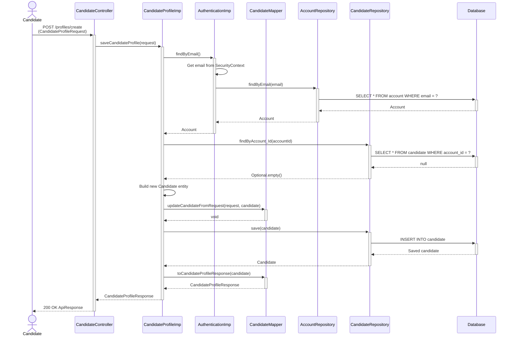
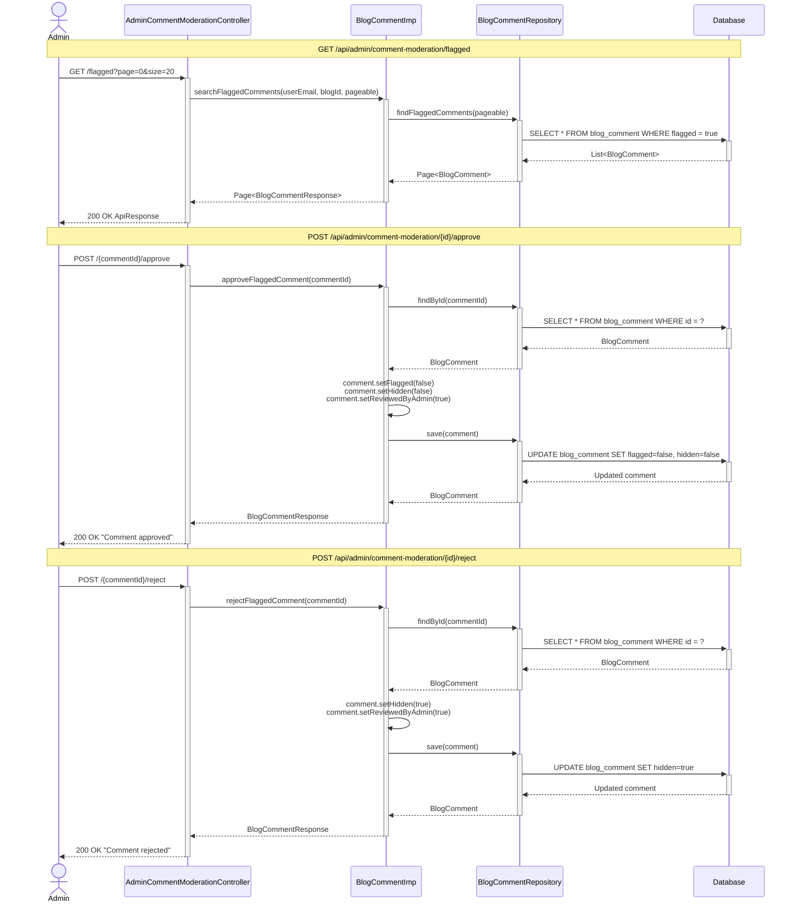
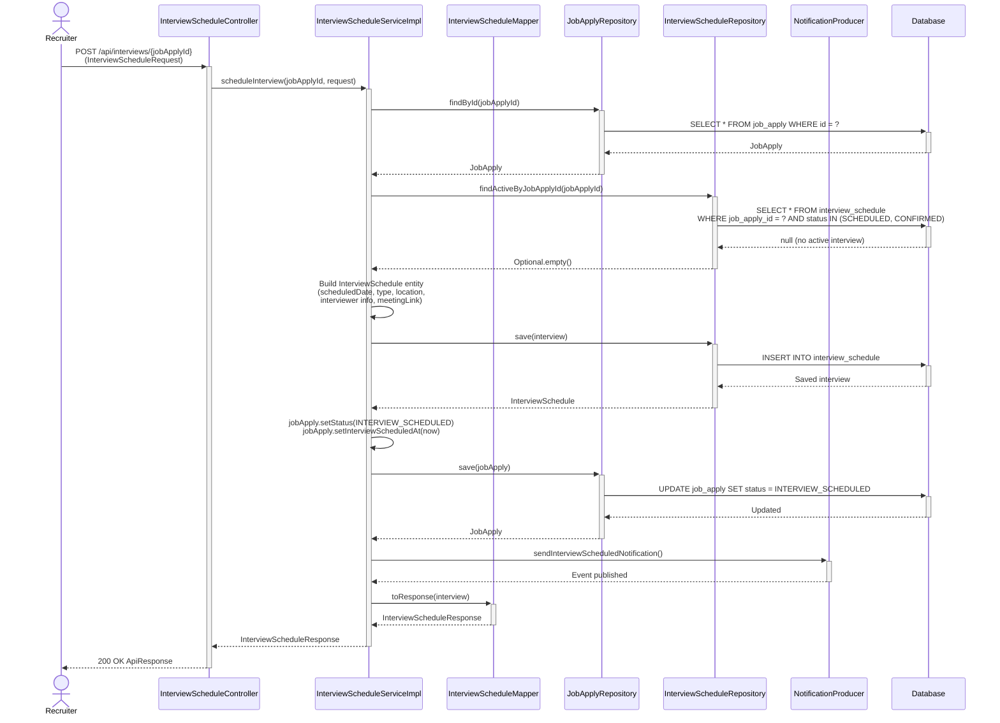
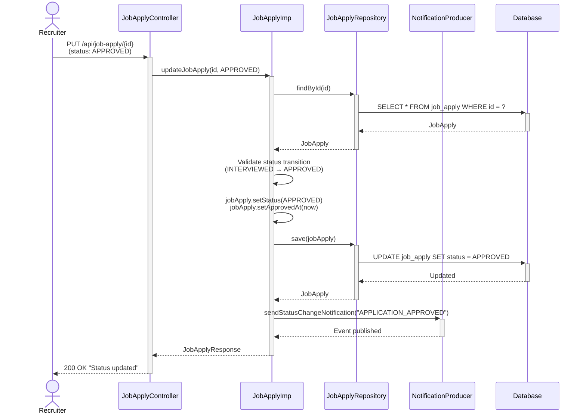

# Candidate Create Profile - Sequence Diagram

## Mermaid Diagram



---

# Admin Manage Comment & Rating Moderation - Sequence Diagram

## Mermaid Diagram



---

# Recruiter Set Up Interview Scheduling - Sequence Diagram

## Mermaid Diagram



---

# Recruiter Approve Application - Sequence Diagram

## Mermaid Diagram



---

## Flow Description

### 1. Request Phase
- **Actor**: Authenticated candidate with JWT token
- **Endpoint**: `POST /api/candidates/profiles/create`
- **Request Body**: `CandidateProfileRequest`
  ```json
  {
    "title": "Software Engineer",
    "jobLevel": "JUNIOR",
    "experience": 2,
    "phone": "0912345678",
    "gender": "MALE",
    "dateOfBirth": "2000-01-15",
    "avatar": "https://storage.url/avatar.jpg"
  }
  ```

### 2. Authentication & Authorization
- **Security**: `@PreAuthorize("hasRole('CANDIDATE')")` on service method
- **Authentication Service**: Extracts email from `SecurityContextHolder`
- **Account Lookup**: Retrieves account from database by email

### 3. Validation Phase
- **Duplicate Check**: Queries `candidate` table by `account_id`
- **Business Rule**: Each account can have only ONE candidate profile
- **Error**: Throws `CANDIDATE_PROFILE_ALREADY_EXISTS` if profile exists

### 4. Entity Creation
- **Builder Pattern**: Creates new `Candidate` entity with:
  - Account reference (from authentication)
  - Empty lists for `industryExperiences` and `workModels`
- **Mapper**: Uses MapStruct to copy fields from request to entity
- **Null Safety**: `NullValuePropertyMappingStrategy.IGNORE` for partial updates

### 5. Persistence
- **Database Operation**: `INSERT INTO candidate`
- **Fields Saved**:
  - `account_id` (FK to account table)
  - `title` (job title)
  - `job_level` (ENTRY/JUNIOR/MIDDLE/SENIOR/LEAD)
  - `experience` (years of experience)
  - `phone` (contact number)
  - `gender` (MALE/FEMALE/OTHER)
  - `date_of_birth`
  - `avatar` (profile picture URL)

### 6. Response Transformation
- **Mapper**: Converts `Candidate` entity to `CandidateProfileResponse` DTO
- **Response Wrapper**: `ApiResponse` with:
  - `code`: 200
  - `message`: "Successfully created candidate profile"
  - `result`: CandidateProfileResponse object

---

## Related Components (from Class Diagram)

### Controllers
- **CandidateController**: REST endpoint handler
  - `@PostMapping("/profiles/create")`
  - Returns `ApiResponse<CandidateProfileResponse>`

### Services
- **CandidateServiceImpl** (CandidateProfileImp):
  - `saveCandidateProfile(request)` - Main business logic
  - `generateProfile()` - Helper to get current candidate
- **AccountService** (AuthenticationImp):
  - `findByEmail()` - Get authenticated user's account

### Repositories
- **AccountRepository**: JPA repository for `account` table
  - `findByEmail(String email)` - Lookup by email
- **CandidateRepository**: JPA repository for `candidate` table
  - `findByAccount_Id(Integer accountId)` - Check existing profile
  - `save(Candidate)` - Persist new profile

### Mappers
- **CandidateMapper** (MapStruct interface):
  - `updateCandidateFromRequest()` - Request → Entity
  - `toCandidateProfileResponse()` - Entity → Response DTO

---

## Database Operations

### Tables Involved
1. **account** (READ)
   - Lookup by email to get authenticated user
2. **candidate** (READ, INSERT)
   - Check for existing profile by account_id
   - Insert new profile record

### SQL Queries
```sql
-- 1. Get account from JWT token email
SELECT * FROM account WHERE email = 'candidate@email.com';

-- 2. Check if candidate profile exists
SELECT * FROM candidate WHERE account_id = 123;

-- 3. Insert new candidate profile
INSERT INTO candidate (
    account_id, title, job_level, experience, 
    phone, gender, date_of_birth, avatar
) VALUES (123, 'Software Engineer', 'JUNIOR', 2, 
          '0912345678', 'MALE', '2000-01-15', 'https://...');
```

---

## Error Scenarios

### 1. Profile Already Exists
- **Condition**: `candidateRepo.findByAccount_Id()` returns existing candidate
- **Error Code**: `CANDIDATE_PROFILE_ALREADY_EXISTS`
- **HTTP Status**: 400 Bad Request
- **Message**: "Candidate profile already exists"

### 2. Unauthenticated Request
- **Condition**: No JWT token or invalid token
- **Error Code**: `UNAUTHENTICATED`
- **HTTP Status**: 401 Unauthorized

### 3. Insufficient Permissions
- **Condition**: User doesn't have `ROLE_CANDIDATE`
- **HTTP Status**: 403 Forbidden
- **Spring Security**: Blocks at `@PreAuthorize` annotation

### 4. Account Not Found
- **Condition**: Email in JWT doesn't exist in database
- **Error Code**: `USER_NOT_EXISTED`
- **HTTP Status**: 404 Not Found

---

## Key Design Patterns

1. **Repository Pattern**: Data access through CandidateRepo, AccountRepo
2. **Service Layer**: Business logic in CandidateProfileImp
3. **DTO Pattern**: Separate request/response objects from entities
4. **Builder Pattern**: Candidate entity creation with `.builder()`
5. **Mapper Pattern**: MapStruct for object transformations
6. **Exception Handling**: Custom `AppException` with `ErrorCode` enum

---

## Related Endpoints

- **Update Profile**: `PUT /api/candidates/profiles` - Updates existing profile
- **Get Current Profile**: `GET /api/candidates/profiles/current` - Retrieves own profile
- **Get Profile by ID**: `GET /api/candidates/profiles/{id}` - Admin/Recruiter view

---

*Generated from CareerMate BE - Profile Services*
*Last Updated: December 13, 2025*
