# CareerMate Sequence Diagrams

This document contains Mermaid sequence diagrams for the core workflows in the CareerMate job application platform.

---

## 1. Job Application Submission Flow

---

## 2. Interview Scheduling & Management Flow

---

## 3. Bilateral Status Verification Flow (Dispute Resolution)

---

## 4. Candidate Recommendation & Matching Flow

```mermaid
sequenceDiagram
    actor R as Recruiter
    participant CRC as CandidateRecommendationController
    participant CRS as CandidateRecommendationService
    participant QSS as QualificationScoringService
    participant CWS as CandidateWeaviateService
    participant JPS as JobPostingService
    participant DB as Database
    participant Weaviate as Weaviate Vector DB
    
    R->>CRC: GET /api/recommendations/{jobPostingId}
    activate CRC
    
    CRC->>CRS: getRecommendedCandidates(jobPostingId, limit=50)
    activate CRS
    
    CRS->>JPS: getJobPosting(jobPostingId)
    activate JPS
    JPS->>DB: Fetch job posting details
    DB-->>JPS: Job with requirements
    Note over JPS: Required skills: Java, Spring Boot<br/>Experience: 3+ years<br/>Location: Hanoi<br/>Salary: 1500-2000 USD
    JPS-->>CRS: JobPostingDetails
    deactivate JPS
    
    CRS->>CWS: searchSimilarCandidates(jobRequirements)
    activate CWS
    
    CWS->>Weaviate: Vector similarity search
    Note over Weaviate: Query by skill embeddings<br/>+ experience vector<br/>+ location filter
    Weaviate-->>CWS: Top 100 candidate IDs
    
    CWS-->>CRS: CandidateList
    deactivate CWS
    
    CRS->>DB: Load candidate profiles (batch)
    DB-->>CRS: Full candidate data
    
    loop For each candidate
        CRS->>QSS: calculateQualificationScore(candidate, job)
        activate QSS
        
        QSS->>QSS: Score skills match (40%)
        Note over QSS: Required skills: 100%<br/>Bonus skills: +20%<br/>Total skills score: 8.5/10
        
        QSS->>QSS: Score experience (30%)
        Note over QSS: Years: 4 (meets 3+ req)<br/>Relevant positions: +10%<br/>Total exp score: 9.0/10
        
        QSS->>QSS: Score education (20%)
        Note over QSS: Degree match: Bachelor CS<br/>GPA: 3.5/4.0<br/>Total edu score: 8.0/10
        
        QSS->>QSS: Score location & preferences (10%)
        Note over QSS: Same city: +5%<br/>Salary expectation match: +4%<br/>Total pref score: 9.0/10
        
        QSS->>QSS: Calculate weighted total
        Note over QSS: Final Score = <br/>(8.5×0.4) + (9.0×0.3) + <br/>(8.0×0.2) + (9.0×0.1) = 8.6/10
        
        QSS-->>CRS: QualificationScore: 8.6
        deactivate QSS
    end
    
    CRS->>CRS: Sort by score descending
    CRS->>CRS: Filter by minimum threshold (>= 6.0)
    CRS->>CRS: Limit to top 50
    
    CRS->>DB: Check existing applications
    Note over DB: Exclude candidates who already applied
    
    CRS-->>CRC: RecommendationResponse[]
    Note over CRC: [<br/>  {candidateId: 123, score: 8.6, matchRate: 86%},<br/>  {candidateId: 456, score: 8.2, matchRate: 82%},<br/>  ...<br/>]
    deactivate CRS
    
    CRC-->>R: 200 OK + Candidate list
    deactivate CRC
    
    R->>R: Review candidates
    R->>CRC: POST /api/recommendations/invite
    Note over R: Send job invitation to top candidates
```

---

## 5. Employment Contract Lifecycle Flow

---

## 6. Company Review Submission & Moderation Flow

---

## 7. Payment Processing Flow (Recruiter & Candidate)

---

## 8. Email Delivery, File Storage & Blog Management Flow

### 8.1 Email Notification System (Generic Flow)

### 8.2 File Storage Flow (Firebase)

### 8.3 Blog Management Flow

---

## Diagram Usage Notes

**Viewing Mermaid Diagrams:**
1. Copy the code blocks to [Mermaid Live Editor](https://mermaid.live)
2. View in VS Code with Mermaid extension
3. Render in markdown viewers that support Mermaid

**Diagram Conventions:**
- **Actors** (hexagon): Human users (Candidate, Recruiter, Admin)
- **Participants** (rectangle): System components (Controllers, Services, Database)
- **Solid arrows** (→): Synchronous calls
- **Dashed arrows** (-->>): Responses
- **Activate bars**: Show execution time
- **Notes**: Provide context and data examples
- **Alt/Opt blocks**: Show conditional flows

**Integration Points:**
- 🟢 **Kafka**: Async event-driven notifications
- 🔵 **Firebase**: Cloud file storage
- 🟣 **Payment Gateways**: VNPay, Stripe
- 🟡 **SMTP**: Email delivery
- 🔴 **Weaviate**: Vector similarity search

---

**Last Updated**: December 13, 2025  
**Format**: Mermaid Sequence Diagrams  
**Status**: Production-ready documentation
